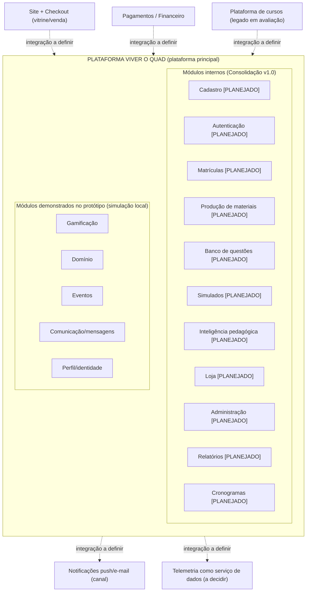

# Arquitetura Oficial da Plataforma Viver o Quad — Consolidação v1.0

**Data:** 01/08/2026
**Autoridade:** Consolidação Arquitetural v1.0, determinada pelo gestor Danilo Moura
**Status:** ESTE É O DOCUMENTO ARQUITETURAL OFICIAL E ÚNICO DO PROJETO

> Em caso de conflito com qualquer documento anterior (registro de decisões,
> auditoria de 30/07/2026, relatório rev. 2.3), **este documento prevalece**.
> Ver a hierarquia documental na seção 7.

---

## 1. Premissa: o Viver o Quad é a plataforma principal do Quad Concursos

A partir da Consolidação v1.0, o **Viver o Quad deixa de ser "um app satélite
de uma plataforma-base externa"** (premissa do relatório rev. 2.3 e da
auditoria de 30/07) e passa a ser **a plataforma principal do Quad Concursos**.
Onze capacidades que os documentos anteriores tratavam como sistemas externos
passam a ser **módulos internos** da plataforma (seção 2).

### O que isso SIGNIFICA

- A plataforma é a **dona lógica** dos dados e das regras dos seus módulos
  internos (cadastro, matrículas, questões, pedagogia, loja etc.).
- O mapa de ecossistema da auditoria
  ([docs/auditoria/07-mapa-do-ecossistema.md](../auditoria/07-mapa-do-ecossistema.md))
  continua valendo como **inventário de necessidades**, mas sua matriz de
  propriedade fica **superada** onde atribuía essas capacidades a sistemas
  externos: elas agora pertencem à plataforma.
- Sistemas que permanecem fora (seção 3) conversam com a plataforma por
  **integrações a definir**.

### O que isso NÃO significa

- **Não determina implementação imediata.** A mudança é exclusivamente
  arquitetural: **nada foi implementado**. Nenhum módulo ganhou back-end,
  banco de dados ou autenticação real por causa desta consolidação.
- **Não muda o protótipo.** O comportamento funcional e a experiência do
  usuário do protótipo não mudaram (a reorganização do código de 01/08 teve
  saída byte-idêntica e regressão verde de 56 suítes).
- **Não transforma simulação em produto.** O que o protótipo demonstra segue
  sendo simulação local no navegador. Módulo sem especificação suficiente é
  **"Módulo Planejado"** — e ponto.
- **Não define tecnologia, topologia nem cronograma de construção.** Isso é
  trabalho da próxima fase (seção 8).

---

## 2. Módulos da plataforma

Vocabulário de status (obrigatório):

- **Demonstrado no protótipo (simulação local)** — a capacidade é encenada no
  protótipo navegável, 100% no navegador, sem back-end.
- **Módulo Planejado** — a capacidade pertence à arquitetura da plataforma,
  mas não tem especificação suficiente nem implementação.
- Os dois status **podem coexistir** num mesmo módulo: a demonstração existe
  E o módulo real ainda precisa ser especificado.

### 2.1 Os 11 módulos internos novos (antes tratados como sistemas externos)

| Módulo | Status | Responsabilidade (1 linha) | Evidência |
|---|---|---|---|
| **Cadastro** | Módulo Planejado | Fonte da verdade de quem é o aluno (conta, dados pessoais) | Portão "Cadastro no site do Quad" segue no protótipo como demonstração do fluxo antigo: `src/10-js-acesso-tutorial.html`; [auditoria doc 07, S3](../auditoria/07-mapa-do-ecossistema.md) |
| **Autenticação** | Demonstrado no protótipo (simulação local) + Módulo Planejado | Identidade, sessões, papéis e revogação de acesso | Gates apenas visuais: `src/10` (aluno), `src/09` (professor), `src/16` (chave N.P.P.); [doc 07, S4](../auditoria/07-mapa-do-ecossistema.md) |
| **Matrículas** | Demonstrado no protótipo (simulação local) + Módulo Planejado | Vínculo aluno×turma, vigência e regras de acesso | `MATRICULAS` em `src/07-js-estado-dados.html`; [doc 07, S5](../auditoria/07-mapa-do-ecossistema.md) |
| **Produção de materiais** | Demonstrado no protótipo (simulação local) + Módulo Planejado | Publicação e distribuição de arquivos didáticos por turma | `MATERIAIS` (admin) em `src/16-js-admin-controle.html`; [doc 07, S12](../auditoria/07-mapa-do-ecossistema.md) |
| **Banco de questões** | Demonstrado no protótipo (simulação local) + Módulo Planejado | Questões, gabaritos e árvores de edital | Bancos demo hardcoded + motor de quiz em `src/08-js-eventos-cal-quiz.html`; [doc 07, S9](../auditoria/07-mapa-do-ecossistema.md) |
| **Simulados** | Demonstrado no protótipo (simulação local) + Módulo Planejado | Lançamento, inscrição, aplicação (presencial/digital) e histórico de simulados | `src/11-js-missoes-treinamento.html`, `src/18-js-admin-hoje-loja.html`; [doc 07, S13](../auditoria/07-mapa-do-ecossistema.md) |
| **Inteligência pedagógica** | Demonstrado no protótipo (simulação local) + Módulo Planejado | Missões, quizzes, blocos do dia, régua teoria×questões e leitura de desempenho | `src/11` (blocos/treinamento), `src/12` (Quadrômetro), `src/13` (Domínio); [doc 07, S10](../auditoria/07-mapa-do-ecossistema.md) |
| **Loja** | Demonstrado no protótipo (simulação local) + Módulo Planejado | Catálogo, estoque, posse, pedidos e skins (vitrine completa na demo) | `src/14-js-loja-economia.html`, `src/15`, `src/18`, `src/19`; [doc 07, S14](../auditoria/07-mapa-do-ecossistema.md). Regras econômicas indefinidas — ver seção 5 |
| **Administração** | Demonstrado no protótipo (simulação local) + Módulo Planejado | Parametrização e governança da operação (persona N.P.P. é a demo dele) | `src/05-html-admin.html`, `src/13`, `src/16`, `src/17`, `src/18`; [doc 07, S11](../auditoria/07-mapa-do-ecossistema.md) |
| **Relatórios** | Demonstrado no protótipo (simulação local) + Módulo Planejado | Relatórios operacionais e pedagógicos para gestão e professor | `src/20-js-relatorios-boot.html` (gráficos), `src/19` (compras/estornos), `src/09` (professor); [doc 07, S16](../auditoria/07-mapa-do-ecossistema.md) |
| **Cronogramas** | Demonstrado no protótipo (simulação local) + Módulo Planejado | Cronograma de estudos por turma (hoje, snapshot fixo da "semana 30") | `CRONO` em `src/07`; edição em `src/16-js-admin-controle.html`; [doc 07, S10](../auditoria/07-mapa-do-ecossistema.md) |

**Nota sobre Cadastro:** a decisão 21 do
[registro de decisões](../02-registro-de-decisoes.md) ("cadastro
obrigatoriamente no site") foi **revogada** pela Consolidação v1.0 — o
cadastro pertence à arquitetura da plataforma. O **fluxo novo não foi
implementado**: o protótipo mantém o portão "Cadastro no site do Quad" como
demonstração, até a especificação do módulo.

### 2.2 Módulos já demonstrados no protótipo

| Módulo | Status | Responsabilidade (1 linha) | Evidência |
|---|---|---|---|
| **Gamificação** | Demonstrado no protótipo (simulação local) | Score, patentes, insígnias, rankings e promoções | `src/12-js-gamificacao-perfil.html`, `src/02-css-gamificado.html`; [doc 07, S7](../auditoria/07-mapa-do-ecossistema.md) |
| **Domínio** | Demonstrado no protótipo (simulação local) | Árvore de edital do aluno com autoavaliação de domínio por sub-assunto | `src/13-js-admin-estrutura.html` ("Definir Domínio"), views do aluno em `src/03`; [doc 04](../auditoria/04-funcionalidades-e-status.md) |
| **Eventos** | Demonstrado no protótipo (simulação local) | Agenda, inscrições, vagas, eventos online/presenciais e portaria | `src/08-js-eventos-cal-quiz.html`, `src/17-js-admin-liberacoes.html`; [doc 07, S13](../auditoria/07-mapa-do-ecossistema.md) |
| **Comunicação/mensagens** | Demonstrado no protótipo (simulação local) | Recados, avisos e mensagens por público (chat de mão única na demo) | `src/16-js-admin-controle.html` (mensagens por público), overlay de chat em `src/06`; [doc 07, S15](../auditoria/07-mapa-do-ecossistema.md) |
| **Perfil/identidade** | Demonstrado no protótipo (simulação local) | Identificação militar, nome de guerra, avatares e skins do personagem | `src/12-js-gamificacao-perfil.html`, `src/11` (avatares), `src/15-js-mochila-skins.html` |

---

## 3. O que permanece FORA da plataforma

| Sistema externo | Por quê permanece fora | Integração |
|---|---|---|
| **Site e checkout** (vitrine/venda) | Vitrine institucional e venda são a porta comercial do Quad, com ciclo de vida próprio | A definir |
| **Pagamentos / financeiro** | Dinheiro real, estornos e conciliação exigem gateway e domínio financeiro próprios | A definir |
| **Plataforma de cursos** | Legado em avaliação — decisão sobre seu futuro está pendente | A definir |
| **Notificações push/e-mail** | É um **canal** de entrega, não um domínio da plataforma | A definir |
| **Telemetria como serviço de dados** | Permanece como serviço de dados **a decidir** (a plataforma tem o módulo interno de Relatórios; o serviço de telemetria/eventos é outra coisa) | A definir |

Nenhuma dessas integrações está definida ou implementada. Os pontos
`[INTEGRAÇÃO REAL]` no fonte e o `LINKS_ONLINE` (preservado em
`src/20-js-relatorios-boot.html` como ponto de integração planejado) são o
mapa dessas costuras futuras.

---

## 4. Diagrama da plataforma

Os 11 módulos internos novos estão marcados **[PLANEJADO]** — vários deles
também têm demonstração no protótipo (tabela 2.1), mas **nenhum** tem
implementação real.

---

## 5. Economia: prevista, com regras indefinidas

A Loja, os **Quad Coins**, os **Diamantes** e os **gift cards** permanecem
previstos na plataforma. Porém:

- **As regras econômicas seguem INDEFINIDAS** — não foram estudadas.
- Preços, taxas de conversão, política de estornos, validade de saldos,
  limites e lastro **não têm decisão de produto**.
- **É proibido inventar regras econômicas** em qualquer documento, código ou
  especificação. O que existe no protótipo (valores, saldos, catálogos) é
  cenografia de demonstração, não política econômica.
- Registrar a indefinição é o comportamento correto; preencher a lacuna, não.

---

## 6. Segurança: pendências registradas

Os riscos apontados pela auditoria de 30/07/2026 **permanecem válidos** e
ficam registrados como **pendências** da plataforma. **Nenhuma solução foi
implementada.** Referências:

- [docs/auditoria/00-resumo-executivo.md](../auditoria/00-resumo-executivo.md), §5.3 — riscos de segurança e LGPD:
  1. Toda autorização é do lado do cliente; credenciais demo hardcoded (algumas impressas na tela).
  2. Hooks `window.__*` e gabaritos embarcados no HTML público (fraude trivial em produção).
  3. Dados pessoais simulados plausíveis demais (nomes, telefones no padrão real).
  4. Perfilamento previsto (Domínio + autoavaliação + IRA) sem governança especificada; ranking sem opt-out persistente.
- [docs/auditoria/07-mapa-do-ecossistema.md](../auditoria/07-mapa-do-ecossistema.md), §6 — riscos transversais.
- [docs/auditoria/09-integracoes-futuras.md](../auditoria/09-integracoes-futuras.md) — observações transversais.
- [docs/auditoria/12-plano-de-transformacao.md](../auditoria/12-plano-de-transformacao.md) — Fase 18 (Segurança/LGPD).

Essas pendências são **bloqueantes para qualquer versão com dado real** e
devem ser endereçadas na especificação dos módulos de Autenticação, Cadastro
e Relatórios/telemetria.

---

## 7. Hierarquia documental vigente

Em caso de conflito, vale a ordem (do mais forte para o mais fraco):

1. **Este documento** (`docs/arquitetura/00-arquitetura-oficial.md`) — a arquitetura oficial e única.
2. **Registro de decisões** ([docs/02-registro-de-decisoes.md](../02-registro-de-decisoes.md)).
3. **Auditoria de 30/07/2026** ([docs/auditoria/](../auditoria/README.md), 14 docs + README).
4. **Relatório rev. 2.3** ([docs/Viver-o-Quad-Relatorio-rev2-3.pdf](../Viver-o-Quad-Relatorio-rev2-3.pdf)).

**A Consolidação v1.0 prevalece sobre decisões anteriores conflitantes.** Em
particular: a decisão 21 está **revogada** (seção 2.1), e as atribuições de
propriedade a "sistemas externos" nos docs 07/08/09 da auditoria ficam
superadas para as 11 capacidades internalizadas — o conteúdo técnico desses
documentos (fluxos, dados, contratos, riscos) segue válido como levantamento.

Nota de leitura: as referências "src.html l.N" dos documentos da auditoria
valem para o monolito de 30/07; o fonte hoje está dividido em 20 partes
contíguas em `src/` (a concatenação na ordem reproduz o monolito —
ver [src/README.md](../../src/README.md)).

---

## 8. Próxima fase — e o que está proibido até lá

### O que a próxima fase fará

- **Especificação módulo a módulo**: para cada Módulo Planejado, um documento
  de especificação (responsabilidades, dados que possui, contratos com os
  demais módulos e com os sistemas externos, requisitos de segurança/LGPD).
- Ordem e critérios de priorização a definir pelo gestor, apoiados no
  [plano de transformação](../auditoria/12-plano-de-transformacao.md) da auditoria.
- Definição das integrações com os sistemas que permanecem fora (seção 3).

### O que está PROIBIDO até lá

- **Implementar** qualquer módulo sem especificação aprovada.
- **Inventar regras econômicas** (seção 5) ou decisões de produto não tomadas.
- **Descrever módulos planejados como implementados** em qualquer documento.
- **Alterar o comportamento do protótipo** (inclusive o portão de cadastro no
  site), salvo determinação expressa do gestor. *Atualização 03/08: as dec.
  196 e 197 são determinações desse tipo — implementaram seis Decisões
  Administrativas no protótipo (DA-01/03/04/06/08/10), **corrigiram o bug do
  reset** (que não limpava `vq_intro_done` e hoje limpa as três chaves) e
  unificaram a carteira do aluno.*
- **Contradizer este documento** em documentos de hierarquia inferior sem nova
  consolidação formal do gestor.
