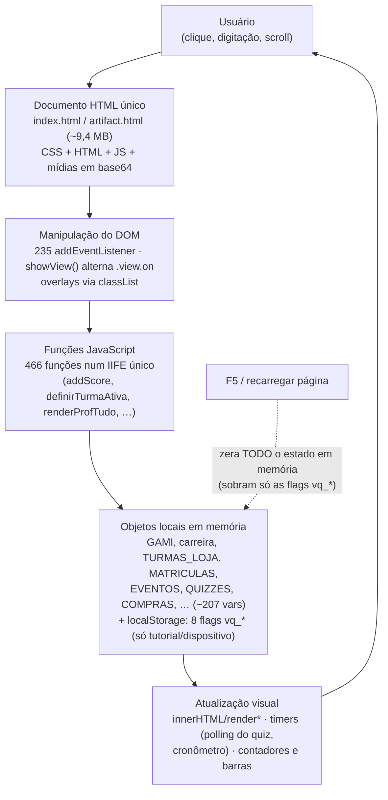

# 01 · Mapa do Protótipo — "Viver o Quad" (V0 "Prova de Vida")

**Data:** 30/07/2026
**Fonte:** auditoria do protótipo (src.html, build, docs/ e relatório rev. 2.3)

> **Este documento descreve um PROTÓTIPO NAVEGÁVEL. Nada aqui é sistema de produção; comportamentos são simulados localmente no navegador, salvo indicação em contrário.**

Este é o mapa de orientação do repositório `/home/user/viveroquad` para quem nunca viu o projeto: o que cada arquivo é, como o build funciona, como o `src.html` se organiza por dentro, quais estados globais movem o protótipo e onde estão os pontos críticos. Toda afirmação classificada segue o vocabulário obrigatório da auditoria (CONFIRMADO NO CÓDIGO, APENAS VISUAL, SIMULADO LOCALMENTE, DEPENDE DO BACK-END etc.); o que não pôde ser verificado está marcado como HIPÓTESE.

---

## Atualização — Consolidação Arquitetural v1.0 (01/08/2026)

*Seção acrescentada em 01/08/2026. O restante deste documento é o retrato verificado de 30/07/2026; o §2 (fluxo de build) foi corrigido para o estado vigente.*

A Consolidação Arquitetural v1.0 (`docs/arquitetura/00-arquitetura-oficial.md`) reorganizou o fonte **sem alterar o comportamento funcional nem a experiência do usuário** do protótipo: a divisão do arquivo tem saída de build byte-idêntica, e a limpeza de código morto passou com regressão completa (56 suítes).

**1. `src.html` foi dividido em 20 partes contíguas em `src/`** (`NN-descricao.html`): a concatenação na ordem do prefixo numérico reproduz o monolito. Nenhuma parte é HTML/CSS/JS válido sozinha; a ordem é imutável; as regras de ouro e a tabela completa estão em `src/README.md`. Resumo das partes:

| Parte | Conteúdo |
|---|---|
| 01-css-base | Título, `__FONTS__`, temas claro/escuro, moldura `.phone`, login, portões, tutorial |
| 02-css-gamificado | CSS do redesign gamificado: herói, admin, Loja, insígnias, rankings, media queries |
| 03-html-aluno | Masthead, barra de personas e as 9 views do aluno |
| 04-html-professor | As 5 views do professor |
| 05-html-admin | As 8 views do administrador N.P.P. |
| 06-html-overlays | Overlays (prova, quizzes, compra, chat, portões, tutorial), artes vetoriais, 3 navbars |
| 07-js-estado-dados | Abertura do `<script>`/IIFE, estado global, moedas, docentes, turmas, matrículas, concursos |
| 08-js-eventos-cal-quiz | Eventos + página do evento, calendário do aluno, motor de quiz, aula de hoje |
| 09-js-professor | Gate/login do professor, painel, relatórios, quiz ao vivo com polling |
| 10-js-acesso-tutorial | Conectividade, acesso ao portal, tutorial do QUAD |
| 11-js-missoes-treinamento | Treinamento rápido, blocos do dia por turma, simulados do aluno, avatares |
| 12-js-gamificacao-perfil | Insígnias, rankings/Quadrômetro, promoções, simulado digital, central de tutoriais |
| 13-js-admin-estrutura | Estrutura/Domínio, criação de turmas e isoladas, banco de professores, reset da demo |
| 14-js-loja-economia | Loja: moedas, compras, catálogos, salas/lotações, overlay de compra, skins |
| 15-js-mochila-skins | Mochila de combate e cadeia de skins do personagem |
| 16-js-admin-controle | Gate N.P.P., contas/créditos, mensagens por público, gift cards, cronograma, materiais |
| 17-js-admin-liberacoes | Eventos do admin, pedidos/retiradas, portaria (autorizações de acesso), PDF de inscritos |
| 18-js-admin-hoje-loja | Lançamento de simulados, dificuldades por aluno, governança da Loja |
| 19-js-compras-estornos | Relatório de compras e estornos de 7 dias (lado do aluno) |
| 20-js-relatorios-boot | Relatórios com gráficos, cascata de inicialização, fechamento do IIFE |

**2. `build.py` agora é portátil e validado**: caminho relativo ao script (o caminho absoluto fixo foi eliminado), concatenação das 20 partes de `src/` com validação da contagem (aborta se não achar exatamente 20), validação de **token ausente** e de **sobra de token não substituído**. `build.ps1` espelha as mesmas validações. Isso resolve o ponto crítico nº 1 do §8 e a DECISÃO TÉCNICA PENDENTE do §2.3.

**3. Arquivos removidos do repositório**: `Viver o Quad.rar` (9 MB) e `quad-coin.png` (904 KB, órfão de build) — resolve o ponto crítico nº 3 do §8.

**4. Código morto removido do fonte** (~40 linhas; regressão completa com 56 suítes — atende parcialmente o ponto crítico nº 10 do §8): a `hojeISO` duplicada/sombreada; o fluxo revogado de autorização de dispositivo (vars `currentEmail`, `scenario`, `pendingRunTour`, `CODE_OK`, `deviceAuthorized`, `pendingAnswers`, o objeto `LS {auth,sync,pend}` e as chaves `vq_device_authorized`/`vq_last_sync`/`vq_pending`); as chaves de tutorial nunca lidas (`vq_tut_step`/`vq_tut_done`/`vq_tut_rew`); as funções nunca chamadas (`openQuiz`, `fmtSync`, `tutDadosOk`); e 8 comentários enganosos atualizados. **As chaves de localStorage vivas agora são só `vq_tut_skip` e `vq_intro_done`** — a tabela do §6.3 abaixo retrata as 8 chaves de 30/07. `LINKS_ONLINE` foi **preservado** como ponto de integração planejado. O bug do reset (não limpa `vq_intro_done`) **não** foi corrigido — corrigi-lo mudaria comportamento — e segue documentado.

> **Nota global:** as referências "src.html l.N" deste e dos demais docs da auditoria valem para o monolito de 30/07; a concatenação das partes na ordem o reproduz (menos ~40 linhas de código morto removidas em 01/08).

---

## 1. Estrutura de arquivos do repositório

O repositório é um protótipo de **arquivo único**: um `src.html` editável + mídias soltas + dois scripts de build que embutem as mídias como data-URIs base64 e geram os arquivos finais (`artifact.html` e `index.html`, não versionados). Inventário verificado por `ls`, `git ls-files` (106 arquivos rastreados) e `.gitignore` (CONFIRMADO NO CÓDIGO).

### 1.1 Raiz

| Arquivo | Tamanho | Papel | Versionado? |
|---|---|---|---|
| `src.html` | 764 KB (11.920 linhas) | **FONTE ÚNICA editável**: CSS + HTML + JavaScript com 10 tokens de mídia | Sim |
| `build.py` | 1,8 KB (35 linhas) | Build em Python — gera `artifact.html` e `index.html` | Sim |
| `build.ps1` | 3,1 KB (35 linhas) | Build em PowerShell — mesma função, para Windows | Sim |
| `index.html` | ~9,4 MB | **SAÍDA de build** — abre com clique duplo, roda 100% offline | **Não** (.gitignore) |
| `artifact.html` | ~9,4 MB | **SAÍDA de build** — conteúdo para publicação como Artefato | **Não** (.gitignore) |
| `README.md` | 4,0 KB | Porta de entrada do repo (**desatualizado — ver §7 e doc. de documentação**) | Sim |
| `CHANGELOG.md` | 132 KB (2.150 linhas, 116 entradas) | Histórico do trabalho, uma entrada por rodada | Sim |
| `Viver o Quad.rar` | 9,0 MB | **Cópia compactada não referenciada por nenhum doc/script** (HIPÓTESE: backup antigo, data igual à do commit inicial) | **Sim (rastreado!)** |
| `fonts.css` | 348 KB | 6 `@font-face` woff2 em base64 (Exo 2 / Inter) → token `__FONTS__` | Sim |
| `danilo.mp4` | 2,6 MB | Vídeo 3D do mascote → `__DANILO_VIDEO__` | Sim |
| `danilo-sprite.png` | 275 KB | Sprite com 7 poses do mascote (frames de 118 px) → `__DANILO_SPRITE__` | Sim |
| `logo.jpg` | 41 KB | Logo Quad → `__QUAD_LOGO__` | Sim |
| `simbolo-quad-transparente.png` | 259 KB | Símbolo Quad → `__QUAD_SIMBOLO__` | Sim |
| `avatars.jpg` | 223 KB | Sprite 6×2 com 12 avatares → `__AVATARS__` | Sim |
| `insignias.jpg` | 96 KB | Faixa de insígnias de patente → `__INSIGNIAS__` | Sim |
| `quad-coin.webp` | 17 KB | Moeda Quad Coin → `__QUAD_COIN__` | Sim |
| `quad-coin.png` | 904 KB | **ÓRFÃO** — nenhum dos dois builds usa (ambos usam o .webp) | Sim |
| `diamante.webp` | 41 KB | Moeda Diamante → `__DIAMANTE__` | Sim |
| `fotos/` (84 arquivos) | 1,4 MB | 7 variantes × 12 fotos (`boina/gandola/colete/fuzil/cipe/patamo/bope`-0..11.webp) → `__FOTOS_VARIANTES__` | Sim |
| `.gitignore` | 131 B | Ignora `index.html`, `artifact.html`, Thumbs.db, desktop.ini | Sim |

### 1.2 docs/

| Arquivo | Tamanho | Papel | Versionado? |
|---|---|---|---|
| `docs/00-comece-aqui-danilo.md` | 2,5 KB | Guia do fundador (roteiro de demo de 3 min) | Sim |
| `docs/01-visao-e-escopo.md` | 2,9 KB | Visão e escopo da V0 | Sim |
| `docs/02-registro-de-decisoes.md` | 47 KB | Registro de decisões numeradas (1 a 181) | Sim |
| `docs/03-guia-de-build-e-publicacao.md` | 2,6 KB | Guia de build/publicação (**desatualizado — ver §7**) | Sim |
| `docs/Viver-o-Quad-Relatorio-rev2-3.pdf` | 125 KB | Relatório-base de produto (rev. 2.3) | Sim |
| `docs/auditoria/` | — | Documentos desta auditoria | Em criação |

### 1.3 O que NÃO existe no repositório

- **Nenhum teste versionado** (0 arquivos `*.spec.*`, sem `package.json`, sem `playwright.config.*`). As suítes Playwright de desenvolvimento viviam fora do repo; a única memória delas são os 31 hooks `window.__*` no src.html (CONFIRMADO NO CÓDIGO — ver §6.4).
- **Nenhuma dependência de rede**: zero `<script src>`, `<link>` externo, `fetch`, `XMLHttpRequest` ou `WebSocket` no src.html (greps com 0 resultados). O `index.html` gerado roda 100% offline (CONFIRMADO NO CÓDIGO).
- **Nenhum servidor, API ou banco de dados** — todo o comportamento é SIMULADO LOCALMENTE no navegador.

---

## 2. Fluxo de build

*(Corrigido em 01/08/2026 — Consolidação v1.0. Até 30/07 o fonte era o monolito `src.html` e o build.py tinha caminho absoluto fixo; ver a Atualização no topo.)*

```
src/01-*.html … src/20-*.html  (20 partes contíguas; concatenadas na ordem
   +                            do prefixo = fonte com 10 tokens __*__)
9 mídias + fonts.css + fotos/ (84 webp)
   │
   ├── build.py   (Python 3 — portátil: caminho relativo ao script;
   │               valida 20 partes, token ausente E sobra de token)
   └── build.ps1  (PowerShell — Windows; espelha as mesmas validações)
   │
   ▼  concatenação → substituição de token → data-URI base64
artifact.html  (~9,4 MB, sem esqueleto <html> — o Artifact embrulha ao publicar)
index.html     (~9,4 MB, com esqueleto parcial — abre com clique duplo, offline)
```

### 2.1 Os 10 tokens

| Token | Arquivo de origem | MIME |
|---|---|---|
| `__FONTS__` | `fonts.css` (texto puro, já contém base64 interno) | text/css |
| `__DANILO_VIDEO__` | `danilo.mp4` | video/mp4 |
| `__DANILO_SPRITE__` | `danilo-sprite.png` | image/png |
| `__QUAD_LOGO__` | `logo.jpg` | image/jpeg |
| `__QUAD_SIMBOLO__` | `simbolo-quad-transparente.png` | image/png |
| `__AVATARS__` | `avatars.jpg` | image/jpeg |
| `__INSIGNIAS__` | `insignias.jpg` | image/jpeg |
| `__QUAD_COIN__` | `quad-coin.webp` | image/webp |
| `__DIAMANTE__` | `diamante.webp` | image/webp |
| `__FOTOS_VARIANTES__` | `fotos/<variante>-<n>.webp` (7×12) | objeto JS `{ variante: { n: 'data:...' } }` |

### 2.2 Diferenças entre os dois scripts (CONFIRMADO NO CÓDIGO)

**Tabela histórica (30/07).** Em 01/08 as diferenças críticas foram eliminadas: build.py passou a usar caminho relativo ao script e os dois scripts validam contagem de partes, token ausente e sobra de token não substituído.

| Aspecto | build.py | build.ps1 |
|---|---|---|
| Caminho-base | **Absoluto fixo** `/home/user/viveroquad` (l. 2) — **quebra em qualquer outra máquina/pasta** | `$PSScriptRoot` (l. 5) — portátil entre pastas, mas exige Windows/PowerShell |
| Token ausente no src.html | **Aborta** (`assert k in out`, l. 30, com mensagem "token ausente") | **Passa em silêncio** (`String.Replace` não falha) — risco de publicar HTML com `__TOKEN__` cru |
| Mídia ausente | `FileNotFoundError` cru (aborta) | Exceção .NET crua (aborta) |
| `fotos/` vazia | **Silencioso** — gera objeto vazio `{ boina: { }, ... }` | Idem |
| Aspas nos data-URIs de fotos | Simples (`%r` do Python) | Duplas |
| Saída | `artifact.html` sem esqueleto; `index.html` com `<!DOCTYPE>` + `<head>` parcial (sem `</head>`, `<body>` e `<title>` próprios — o `<title>` vem da linha 1 do src.html; o parser HTML tolera) | Idêntica em estrutura |

### 2.3 Estado do build (verificado nesta auditoria)

- **Íntegro e sincronizado**: o rebuild via build.py reproduz o `artifact.html` em disco **byte a byte** (verificado por `cmp`). Todas as mídias esperadas existem; os 10 tokens existem no src.html.
- **O último build (28/07) foi feito com build.py** — o `artifact.html` usa aspas simples em `__FOTOS_VARIANTES__`, assinatura do script Python. Isso contradiz o README e docs/03, que só ensinam `build.ps1` (DIVERGÊNCIA DOCUMENTAL — ver §7).
- **Nenhum dos dois scripts é universal**: build.py morre fora de `/home/user/viveroquad`; build.ps1 só roda em Windows/PowerShell. Cada um cobre um ambiente (DECISÃO TÉCNICA PENDENTE: unificar ou corrigir o caminho do build.py). **Resolvido em 01/08**: build.py agora usa caminho relativo ao script e roda em qualquer pasta/SO com Python 3.

---

## 3. Mídias e placeholders

- Todas as mídias entram no HTML final como **data-URI base64** (inflação de ~33%: o danilo.mp4 de 2,6 MB vira ~3,5 MB de texto). Não há streaming nem cache granular — o navegador precisa engolir os ~9,4 MB antes do primeiro paint (CONFIRMADO NO CÓDIGO).
- Cada ocorrência de um token no src.html é substituída pelo base64 **inteiro**: o símbolo Quad é embutido 6× (l. 3333–3565), moeda e diamante 2–3× cada. Desperdício modesto (~1–2 MB), dominado pelo vídeo único (CONFIRMADO NO CÓDIGO).
- **Placeholders/URLs fictícias no conteúdo** (só disparam se clicadas; não afetam o carregamento): âncoras de demonstração "Assistir aula" (youtube.com) e "Fazer questões" (qconcursos.com) na árvore do edital (l. 4185–4186), link `meet.quadconcursos.com.br` em eventos (l. 4257) e um placeholder `https://…` (l. 2686). APENAS VISUAL.
- O "modo offline" exibido dentro do app é um toggle simulado (`var online`, l. 3730), **não** um service worker real. SIMULADO LOCALMENTE.
- Órfãos: `quad-coin.png` (904 KB, nenhum build usa) e `Viver o Quad.rar` (9 MB, nada referencia) — ~10 MB de peso morto versionado (CONFIRMADO NO CÓDIGO; DECISÃO TÉCNICA PENDENTE: remover do versionamento).

---

## 4. Estrutura interna do src.html (11.920 linhas)

### 4.1 Faixas de linhas

| Faixa | Conteúdo |
|---|---|
| 1 | `<title>Viver o Quad — Protótipo V0</title>` |
| 2 | `<style>__FONTS__</style>` (fontes embutidas no build) |
| 3–1570 | **CSS** (~1.568 linhas): variáveis `:root` com temas claro/escuro (`prefers-color-scheme` + `:root[data-theme=…]`, compatível com o toggle do viewer de Artefatos); moldura `.phone` de **384 px fixos** (l. 65); `@media (max-width:860px)` empilha o layout; `@media (prefers-reduced-motion)` desliga animações |
| 1571–3668 | **HTML** (~2.098 linhas): masthead + `.persona-bar` com os 3 botões `data-persona` (l. 1583–1585) + `.stage` com o "telefone" (`.phone/.screen`, l. 1590) e um `<aside>` explicativo ao lado (l. 3609); **22 views** `id="v-*"`; 3 navbars; 21 camadas/overlays |
| 3670–11920 | **JavaScript** (~8.250 linhas): **um único IIFE** `(function () { ... })()` (l. 3671–11919), sem `use strict`, sem módulos; termina com bloco de init (`renderCarreira(); applyConnUI(); updatePending();`, l. 11916–11918) |

O formato geral: em desktop vê-se um "celular" de 384 px com um painel de notas ao lado — **é um protótipo emoldurado, não uma página responsiva de app real** (nada dentro do "telefone" usa a largura real do dispositivo). CONFIRMADO NO CÓDIGO.

### 4.2 As 22 views, agrupadas por persona

A troca de persona é feita pelos botões `.persona-btn[data-persona]` (l. 1583–1585 no HTML; handlers em l. 3917–3941), que ativam a navbar correspondente e restringem as views acessíveis (`personaAtiva`/`personaViews`). Professor e admin têm portões locais (`profGate`/`admGate`) — APENAS VISUAL (validação 100% no cliente). A navegação entre views usa `showView(id, navId)` (l. 4040), que alterna a classe `.view.on` e dispara re-renders.

| Persona | Navbar | Views (linha do HTML) |
|---|---|---|
| **Aluno** (9 views) | `#navAluno` (l. 3584) | `v-inicio` (1661), `v-missoes` (1716), `v-dominio` (1753, prévia V1), `v-perfil` (1773, Quadrômetro), `v-loja` (1819), `v-aluno` (1954, perfil do aluno), `v-pretaf` (2062), `v-calendario` (2099), `v-materiais` (2121) |
| **Professor** (5 views) | `#navProfessor` (l. 3591) | `v-prof-painel` (2134), `v-prof-eventos` (2184), `v-prof-cal` (2197), `v-prof-chat` (2206), `v-sala` (2236, quiz ao vivo) |
| **Admin N.P.P.** (8 views) | `#navAdmin` (l. 3598) | `v-turmas` (2303), `v-edital` (2332), `v-questoes` (2370), `v-adm-controle` (2390), `v-adm-hoje` (2603), `v-adm-liber` (2862), `v-adm-alunos` (2904), `v-adm-loja` (3043) |

### 4.3 Camadas/overlays (21 confirmadas — ids terminados em `Layer`)

- **Quiz/prova/simulado (7):** `provaLayer` (prova de patente), `qaLayer` (quiz da aula — aluno), `quizLayer`, `evLayer` (evento), `trLayer` (Treinamento Rápido), `tqLayer` (missão), `simDigLayer` (simulado digital).
- **Entrada:** `loginLayer`, `splashLayer` (vinheta), `gateLayer` (portão de acesso).
- **Tutorial:** `tutLayer` com sombras, anel, seta, balão e o sprite do Danilo (`tutQuad`).
- **Compra/loja (6):** `compraLayer`, `bloqLayer`, `turmaLayer`, `trocaLayer`, `scanLayer`, `matLayer`.
- **Outros:** `zoomLayer` (zoom de avatar), `storageLayer`, `chatLayer`, `helpLayer` (ajuda do Danilo com vídeo).

### 4.4 Contagens gerais (CONFIRMADO NO CÓDIGO)

22 views · 3 navbars · 21 overlays · 21 blocos `data-bl` no Painel de Controle do admin (20 nomes distintos) · 466 nomes únicos de função (468 declarações) · 235 `addEventListener` · 33 `setTimeout` / 5 `setInterval` · 187 linhas com `innerHTML` contra 17 `createElement` · 81 atributos ARIA · 0 IDs duplicados · 31 hooks `window.__*`.

---

## 5. Agrupamentos funcionais encontrados

O JS não tem módulos formais — é um IIFE único —, mas o código se organiza em blocos temáticos reconhecíveis (comentários de seção no próprio arquivo). Fluxos completos identificáveis (todos SIMULADO LOCALMENTE):

| Agrupamento | O que faz | Âncoras |
|---|---|---|
| **Entrada e onboarding** | login → vinheta → portão → tutorial guiado de **29 passos** (array `TUT`, l. 5764–5857 — a decisão 17 registrava 19 etapas; divergência 9×19×29 anotada nos docs 04 e 10) | `acessarPortal` (l. 5633), `entrarApp` (l. 5677), `TUT` (l. 5764) |
| **Gamificação/carreira** | patentes, fases, prova de promoção (80% promove), score de carreira | `GAMI` (l. 3678), `carreira` (l. 3708), `addPontos` (l. 7498), `prova` (l. 7522) |
| **Economia de duas moedas** | Quad Coins (ganhas) + Diamantes (compradas); loja, estoque, estorno em 7 dias | `score` (l. 3672), `diamantes` (l. 3771), `COMPRAS` (l. 11435), `desfazerCompra` (l. 11592) |
| **Turmas e matrículas** | catálogo, compra, turma ativa que "comanda a tela", cronograma semanal | `TURMAS_LOJA` (l. 3842), `MATRICULAS` (l. 3850), `definirTurmaAtiva` (l. 3867), `CRONO` (l. 4745) |
| **Conteúdo pedagógico** | árvores de edital, questões, missões da noite, Treinamento Rápido, Domínio (prévia) | `EDITAL_CFO` (l. 4092), `CONCURSOS` (l. 4122), `BLOCOS_TURMA` (l. 6264), `TR_BANK` (l. 6122) |
| **Quiz ao vivo professor↔aluno** | professor abre/fecha quiz; aluno responde; relatório "em tempo real" por polling simulado | `QUIZZES` (l. 5275), timer 250 ms (l. 5508) |
| **Eventos e simulados** | inscrição, garimpo, lotação por sala, vagas por moeda, portaria | `EVENTOS` (l. 4226), `SIMULADOS` (l. 6299), `ACESSO_ST` (l. 10820), `SALA_CAP` (l. 8922) |
| **Área do professor** | login por e-mail derivado do sobrenome + senha demo, painel, recados | `DOCENTES` (l. 3815), `emailDoProf` (l. 4917), `RECADOS_PROF` (l. 9945) |
| **Admin N.P.P.** | Painel de Controle com 21 blocos: turmas, edital, questões, preços, crédito, estornos, gift cards, portaria, relatórios (impressão via `window.open`+`print`, l. 10952) | gate `admGate` (chave literal l. 9791), `ESTORNOS` (l. 10124), `GIFT_LOTES` (declaração l. 3783; criação de lotes `btnAdmGift` l. 10096–10112) |
| **Comunicação** | recados admin→aluno e admin→professor, avisos por turma | `RECADOS` (l. 9812), `AVISOS` (l. 10149) |
| **Avatar e identidade visual** | 12 avatares em sprite, variantes de farda por progressão de skins | `AVATAR_VARIANTES` (l. 7117), `SKIN_CADEIA` (l. 9702) |
| **Rankings e relatórios** | posições e nomes sintéticos por hash/fórmula em torno do score real do aluno | `RK_NOMES` (l. 7296), `REL_SEM` (l. 11737) — APENAS VISUAL |

---

## 6. Principais estados globais e armazenamento local

### 6.1 Onde os dados vivem

**100% dos dados de negócio vivem em variáveis JS dentro do IIFE** (~207 `var` de nível superior). Nada de matrícula, compra, score, moeda ou mensagem sobrevive ao F5 — recarregar a página zera tudo, exceto 8 flags `vq_*` no localStorage (CONFIRMADO NO CÓDIGO).

### 6.2 Os "bancos" em memória (seleção; inventário completo no doc. de dados)

| Estado | Linha | Conteúdo | Persiste? |
|---|---|---|---|
| `GAMI` | 3678 | Config central da gamificação (14 patentes, 4 fases, notas mínimas) | Não |
| `carreira` | 3708 | Estado de carreira do aluno (patente, scores, histórico) | Não |
| `score` / `diamantes` | 3672 / 3771 | Saldos das duas moedas (iniciam 1240 / 150) | Não |
| `DOCENTES` | 3815 | 6 professores com telefone, matérias, senha (em texto claro) | Não |
| `TURMAS_LOJA` | 3842 | Catálogo de turmas à venda (atenção: **não existe `var TURMAS`** — o nome real é este) | Não |
| `MATRICULAS` / `turmaAtivaId` | 3850 / 3859 | Matrículas do aluno e turma ativa | Não |
| `DB_ALUNO` | 3946 | Nome e telefone do aluno ("vindos do banco geral do site" — comentário no código) | Não |
| `EDITAL_CFO` / `CONCURSOS` | 4092 / 4122 | Árvores de edital (CFO completa; demais compactas) e 6 concursos | Não |
| `EVENTOS` / `evState` | 4226 / 4263 | 7 eventos seed + estado do aluno (garimpado/inscrito/comprado) | Não |
| `CRONO` | 4745 | Cronograma semanal (snapshot da planilha da coordenação, diz o comentário) | Não |
| `QUIZZES` | 5275 | Quiz da aula por turma (compartilhado professor↔aluno) | Não |
| `TR_BANK` / `BLOCOS_TURMA` | 6122 / 6264 | ~60 flashcards + missões da noite por turma | Não |
| `SIMULADOS` / `SIM_INSC` | 6299 / 6305 | Simulados (vagas por moeda) e portaria | Não |
| `AV_LABELS` / `AVATAR_VARIANTES` | 7061 / 7117 | Avatares e fotos oficiais por variante de farda | Não |
| `SALA_CAP` | 8922 | Lotação das 4 salas físicas (85–185 lugares) | Não |
| `RECADOS` / `RECADOS_PROF` / `AVISOS` | 9812 / 9945 / 10149 | Mensageria simulada | Não |
| `ACESSO_ST` | 10820 | Portaria por evento (liberação consome a compra) | Não |
| `COMPRAS` / `ESTORNOS` | 11435 / 10124 | Log de compras e estornos (janela de 7 dias) | Não |

Tudo acima: SIMULADO LOCALMENTE. No ecossistema previsto, cada estrutura tem um sistema dono provável (cadastro geral, matrículas, financeiro, banco de questões, eventos, notificações, relatórios/BI — mapa completo no documento de dados da auditoria) — ou seja, DEPENDE DO BACK-END / DEPENDE DE BANCO DE DADOS / DEPENDE DE SISTEMA EXTERNO quando sair do protótipo. **Nenhum desses sistemas existe hoje no código.**

### 6.3 Armazenamento local (localStorage — lista completa, 8 chaves)

Wrappers `lsGet/lsSet/lsDel` (l. 3737–3739), com try/catch silencioso. Nenhum dado pessoal ou de negócio vai ao localStorage — só flags de dispositivo/tutorial (CONFIRMADO NO CÓDIGO):

| Chave | Guarda | Situação |
|---|---|---|
| `vq_device_authorized` | dispositivo autorizado | Flag herdada de fluxo removido (dec. 21) — quase morta |
| `vq_last_sync` | timestamp do último "sync" | **Escrita, nunca lida** — telemetria fantasma |
| `vq_pending` | respostas offline pendentes | **Nunca escrita** — código morto do modo offline |
| `vq_tut_step` | passo atual do tutorial | Escrita, **nunca lida** (tutorial interrompido recomeça do zero) |
| `vq_tut_done` | tutorial concluído | Escrita, nunca lida (redundante com `vq_tut_skip`) |
| `vq_tut_rew` | (reserva de recompensa) | Declarada e **jamais usada** |
| `vq_tut_skip` | pular instrução no login | **Única flag de tutorial realmente lida** (l. 5650); usada pela suíte Playwright |
| `vq_intro_done` | missão "Introdução no Quad" feita | Lida no boot (l. 6884), **mas o "Reiniciar demonstração" (l. 8642–8643) NÃO a limpa** — reset incompleto (CONFIRMADO NO CÓDIGO) |

### 6.4 Hooks de teste (`window.__*`)

31 hooks confirmados expostos em `window` (ex.: `__admTudo`, `__eventos`, `__turmaAtiva`, `__evLotar`, `__dominio`, `__avLabel`, `__introFeita`, `__mat`, `__noite`, `__prova`), mais `window.AVATAR_VARIANTES` e `window.lojaCompraLog`. Servem às suítes Playwright de desenvolvimento, **que não estão no repositório**. Os hooks embarcam no artefato publicado — aceitável na V0 (dados fictícios), bloqueante em qualquer versão com dado real (DECISÃO TÉCNICA PENDENTE: build separado dev/prod). CONFIRMADO NO CÓDIGO.

---

## 7. Dependências internas entre os "módulos" simulados

Não há fronteira de módulo: as três personas vivem no **mesmo estado compartilhado** dentro do IIFE (CONFIRMADO NO CÓDIGO):

- `QUIZZES` (l. 5275) é escrito pelo professor (abre/fecha o quiz) e pelo aluno (responde); o relatório "ao vivo" do professor é polling local sobre o mesmo objeto.
- `TURMAS_LOJA` é criada no admin (l. 7899–7982), vendida na Loja do aluno e filtrada para a área do professor (`materiasDoProf`, l. 4903).
- `SALA_CAP` limita turmas, isoladas, simulados e eventos das três áreas.
- `showView` (l. 4040) concentra os gatilhos de re-render de TODAS as personas (renderAulaHoje, renderEventosLoja, renderAcessos, renderProfTudo…).
- O bloco final do IIFE (l. 11875–11888) encadeia hooks de refresh (`__ctSalaRefresh`/`__evSalaRefresh`/`__simSalaRefresh`) e um comentário admite **dependência da ordem de declaração** no arquivo ("ISOLADAS é declarada depois do bloco de criação") — sintoma de fragilidade de sequenciamento.

Esse acoplamento é o que realiza a promessa "tudo conectado em tempo real" da demo (decisão 20) — ao custo de: qualquer mudança num estado pode reverberar em views das três personas, e não existe contrato de interface entre os blocos.

Duplicações e redundâncias já mapeadas: `hojeISO` definida 2× (l. 3852 e 6326 — a segunda sombreia a primeira); `falta` definida 2× em escopos distintos com assinaturas diferentes; `ALUNO_TURMA` redundante com `turmaAtivaId`; saldo de coins tanto hardcoded no HTML (`#lojaSaldo`, "1.240") quanto na `var score`; duas fontes de professores que não se cruzam (`DOCENTES` × nomes da grade `CRONO`). Tudo CONFIRMADO NO CÓDIGO.

---

## 8. Pontos críticos

1. **Fragilidade do build** — build.py com caminho absoluto fixo (morre fora de `/home/user/viveroquad`); build.ps1 sem validação de token (pode publicar HTML com `__TOKEN__` cru); ambos silenciosos com `fotos/` vazia. CONFIRMADO NO CÓDIGO · DECISÃO TÉCNICA PENDENTE.
2. **Documentação defasada em cadeia** — README/docs/00/docs/03 apontam URL antiga do artefato (`4d06ad26-…`; a vigente informada à auditoria é `945e81a8-9ca3-4d55-9169-c4fc9f6f3703`, não citada em nenhum arquivo do repo), só citam build.ps1, falam em "~4 MB"/"~70 KB"/"três mídias" quando a realidade é 9,4 MB / 764 KB / 10 tokens, e a árvore do README omite 11 itens. DIVERGÊNCIA DOCUMENTAL (detalhada no doc 10, de divergências).
3. **Peso morto versionado** — `Viver o Quad.rar` (9 MB) + `quad-coin.png` (904 KB): ~10 MB inúteis em cada clone. CONFIRMADO NO CÓDIGO.
4. **Nada persiste** — todo progresso (score, compras, matrículas, mensagens, escolha de avatar, perfil privado do ranking) se perde no F5; só 8 flags `vq_*` sobrevivem, e 4 delas são total/parcialmente mortas. SIMULADO LOCALMENTE — a persistência real DEPENDE DO BACK-END + DEPENDE DE BANCO DE DADOS.
5. **Segurança apenas visual** — gates de professor e admin são overlays CSS com credenciais demo hardcoded e impressas na própria tela (`quad1234`, `NPP-2026`, `123456`); login do aluno aceita qualquer e-mail com "@". Intencional na demo; qualquer autorização real DEPENDE DO BACK-END. CONFIRMADO NO CÓDIGO + APENAS VISUAL.
6. **Hooks e gabaritos no cliente** — 31 hooks `window.__*` (incl. `__noite.concluirTudo()`, `__evLotar`) e gabaritos de questões dentro dos objetos JS embarcam no artefato público: falsificação de score/compra/presença é trivial pelo console. Aceitável só na V0. CONFIRMADO NO CÓDIGO.
7. **Sem rede de proteção** — 8.250 linhas de JS acoplado num IIFE único, sem `use strict`, sem testes versionados; as suítes Playwright ficaram fora do repo. Manutenção fora do ambiente original opera às cegas. CONFIRMADO NO CÓDIGO.
8. **Arquivo de 9,4 MB por build** — base64 infla mídias, sem streaming/cache; em rede lenta o custo é integral antes do primeiro paint. Aceitável em demo, inviável como app real (o app real DEPENDE DO FRONT-END REAL com assets servidos separadamente).
9. **Acessibilidade incompleta em overlays** — 0 `tabindex`, sem tecla Esc nas 21 camadas, sem focus-trap; ARIA e contraste do texto principal, por outro lado, estão bem resolvidos. CONFIRMADO NO CÓDIGO.
10. **Código morto/provisório autodeclarado** — `demoSobePatente` ("[DEMO PROVISÓRIO — REMOVER]"), `LINKS_ONLINE`, `pendingAnswers`, `fmtSync`/`openQuiz`/`tutDadosOk` nunca chamadas. CONFIRMADO NO CÓDIGO · DECISÃO TÉCNICA PENDENTE.

---

## 9. Diagrama do funcionamento REAL atual

O ciclo abaixo é **tudo o que existe hoje**. Não há API, servidor nem banco de dados em nenhum ponto — os nomes "banco", "portaria", "tempo real" na interface são simulações locais.



Leitura do ciclo: o usuário interage com o documento; listeners no DOM chamam funções do IIFE; as funções **mutam objetos JS em memória** (e, em 8 casos pontuais, flags no localStorage); as mesmas funções redesenham a tela via `innerHTML`/render. O "tempo real" entre professor e aluno é o mesmo objeto (`QUIZZES`) lido por um timer de 250 ms na mesma página. Recarregar a página reinicia a simulação do zero.

---

## 10. Onde continuar a leitura

| Tema | Documento da auditoria |
|---|---|
| Catálogo de telas, painéis e modais (fichas por persona) | 02 (`02-telas-paineis-e-modais.md`) |
| Fluxos do usuário ponta a ponta (19 fluxos) | 03 (`03-fluxos-do-usuario.md`) |
| Matriz de funcionalidades e status (AL/PR/AD/TR) | 04 (`04-funcionalidades-e-status.md`) |
| Regras de negócio embutidas no código (RN-01–RN-61) | 05 (`05-regras-de-negocio.md`) |
| Inventário completo de dados e localStorage | 06 (`06-dados-locais-e-persistencia.md`) |
| Divergências documentais e decisões pendentes | 10 (`10-divergencias-e-decisoes-pendentes.md`) |

*Índice completo dos 14 documentos (00–13) e ordem de leitura sugerida: `docs/auditoria/README.md`.*
