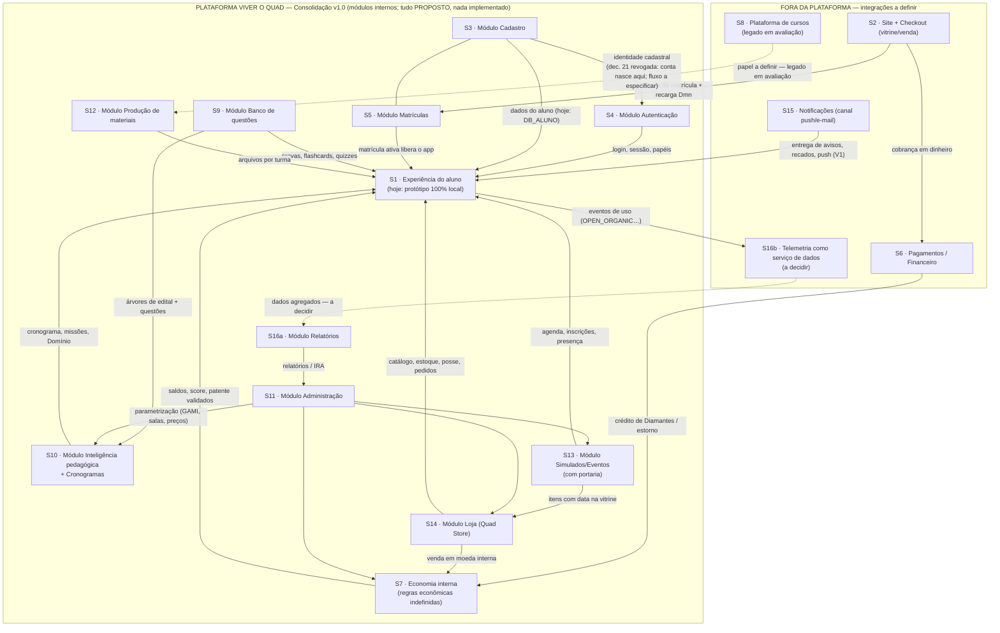

# 07 — Mapa do Ecossistema · Viver o Quad

**Data:** 30/07/2026
**Fonte:** auditoria do protótipo (src.html, build, docs/ e relatório rev. 2.3)

> **Este documento descreve um PROTÓTIPO NAVEGÁVEL. Nada aqui é sistema de produção; comportamentos são simulados localmente no navegador, salvo indicação em contrário.**

---

## Atualização — Consolidação Arquitetural v1.0 (01/08/2026)

**Determinação do gestor Danilo Moura (documento oficial de 01/08/2026):** o Viver o Quad passa a ser **a plataforma principal do Quad Concursos**. Este mapa foi escrito em 30/07 sob a premissa "o app não será dono de tudo"; a Consolidação v1.0 **reinterpreta** essa premissa: onze capacidades que as fichas abaixo tratavam como **sistemas externos** ao app passam a ser **módulos internos da plataforma Viver o Quad**. A mudança é **exclusivamente arquitetural** — nada foi implementado, nenhum comportamento do protótipo mudou, e módulo sem especificação suficiente é **"Módulo Planejado"** (status que pode coexistir com **"Demonstrado no protótipo (simulação local)"** num mesmo módulo).

**Correspondência capacidade (v1.0) × sistemas deste mapa:**

| Capacidade da plataforma (v1.0) | Sistema(s) neste documento | Titularidade v1.0 |
|---|---|---|
| Cadastro | S3 | Módulo interno |
| Autenticação | S4 | Módulo interno |
| Matrículas | S5 | Módulo interno |
| Produção de materiais | S12 | Módulo interno |
| Banco de questões | S9 | Módulo interno |
| Simulados (com eventos e portaria) | S13 | Módulo interno |
| Inteligência pedagógica | S10 | Módulo interno |
| Cronogramas | S10 | Módulo interno |
| Loja (com a economia interna) | S14 + S7 | Módulo interno — **regras econômicas seguem indefinidas** |
| Administração | S11 | Módulo interno |
| Relatórios | S16 (parte de relatórios) | Módulo interno |

**Permanecem FORA da plataforma (integrações a definir):** S2 Site + Checkout (vitrine/venda), S6 Pagamentos/Financeiro, S8 Plataforma de cursos (legado em avaliação), S15 Notificações push/e-mail (como canal de entrega) e a **telemetria como serviço de dados** (a parte de coleta do S16 — a decidir).

**Decisão revogada:** a dec. 21 (cadastro obrigatoriamente no site) foi **revogada** — o cadastro passa a pertencer à arquitetura do app (módulo Cadastro). **O fluxo novo NÃO foi implementado:** o protótipo continua exibindo o portão "Cadastro no site do Quad" como demonstração, até a especificação do módulo.

**O que NÃO muda:** os riscos apontados pela auditoria de 30/07 permanecem válidos e ficam registrados como pendências (nenhuma solução foi implementada); as regras econômicas (loja, Quad Coins, Diamantes, gift cards) permanecem previstas, porém indefinidas (não estudadas); o comportamento funcional e a experiência do usuário do protótipo são os mesmos. As seções e fichas abaixo foram **preservadas como registro da auditoria de 30/07**, com uma linha **"Titularidade (v1.0)"** acrescentada a cada ficha; onde o texto original tratar um item convertido como "sistema externo", leia-se "módulo do Viver o Quad". (Nota: as referências "src.html l.N" valem para o monolito da auditoria; o `src/README.md` explica a correspondência com a divisão em 20 partes de 01/08.)

---

## 1. Como ler este mapa

Este documento converte as **necessidades demonstradas pelo protótipo** em um mapa de **sistemas com responsabilidades LÓGICAS**. Ele **não** define microsserviços, tecnologias nem topologia de implantação — apenas responde: *que sistemas o ecossistema Quad precisa ter, quem é dono de qual dado, e o que cada um troca com o aplicativo*.

Premissas verificadas que sustentam o mapa:

- **Hoje não existe integração nenhuma.** 100% dos dados de negócio do protótipo vivem em variáveis JavaScript dentro de uma IIFE no `src.html`; a única persistência é `localStorage` com 8 flags de tutorial/dispositivo (`lsGet/lsSet`, l. 3737–3739). Recarregar a página zera tudo. CONFIRMADO NO CÓDIGO.
- O próprio código marca os pontos onde o sistema real deve entrar: **24 ocorrências de `[INTEGRAÇÃO REAL]`** no `src.html` (checkout, validação de login, extração de PDF de edital/quiz, gift card real, crédito de Diamantes, chave do admin emitida pela direção etc.). CONFIRMADO NO CÓDIGO.
- O documento-base (relatório rev. 2.3) declara o app como **"braço da plataforma web já em construção (a grande base de dados)"** (docs/01-visao-e-escopo.md, l. 8–10) e afirma que **"todo aluno já existe na plataforma-base"** (l. 56). A auditoria de documentação registrou, a partir do PDF, a stack declarada dessa plataforma (Next.js + Spring Boot + Pagar.me) — **HIPÓTESE quanto ao estado atual**, pois nada disso é verificável dentro deste repositório.
- O app **não será dono de tudo**: a lista de sistemas abaixo cobre o ecossistema previsto (site/checkout, plataforma-base, autenticação, matrículas, pagamentos, cursos, questões, pedagógico, painel administrativo, materiais, eventos, loja, notificações, telemetria/relatórios), mais um sistema de **gamificação/economia** que o relatório rev. 2.3 exige com ledger próprio na V1.

Vocabulário de classificação usado (obrigatório): CONFIRMADO NO CÓDIGO · APENAS VISUAL · SIMULADO LOCALMENTE · DEPENDE DO FRONT-END REAL · DEPENDE DO BACK-END · DEPENDE DE BANCO DE DADOS · DEPENDE DE SISTEMA EXTERNO · HIPÓTESE · DECISÃO DE PRODUTO PENDENTE · DECISÃO TÉCNICA PENDENTE · DIVERGÊNCIA DOCUMENTAL.

**Legenda de existência atual:**
- **EXISTE (fora do app)** — sistema real citado como existente/em construção pelos documentos; não verificado nesta auditoria.
- **SIMULADO no protótipo** — a função é demonstrada no `src.html`, toda local.
- **INEXISTENTE** — nem existe fora, nem passa de encenação no protótipo.

---

## 2. Visão geral do ecossistema

| # | Sistema (nome provisório) | Objetivo em uma linha | Existência atual | Situação no protótipo | Titularidade (Consolidação v1.0) |
|---|---|---|---|---|---|
| S1 | **Aplicativo Viver o Quad** | Experiência diária do aluno (e painéis de professor/admin da demo) | Existe **como protótipo navegável** (arquivo único) | CONFIRMADO NO CÓDIGO | **A própria plataforma principal** do Quad Concursos |
| S2 | **Site principal + Checkout Quad** | Venda, recarga de Diamantes | Em construção segundo docs/01 (HIPÓTESE) | Referenciado por toasts/`[INTEGRAÇÃO REAL]` | **Externo** — integração a definir (dec. 21, sobre criação de conta, revogada) |
| S3 | **Plataforma-base de alunos** (cadastro geral) | Fonte da verdade de quem é o aluno | "Já em construção" (docs/01, l. 9) — HIPÓTESE | Simulada por `DB_ALUNO`/`CONTAS` | **Módulo interno — Cadastro** (Módulo Planejado) |
| S4 | **Autenticação e autorização** | Identidade, sessões, papéis, revogação | INEXISTENTE como serviço do app | Gates APENAS VISUAIS | **Módulo interno — Autenticação** (Módulo Planejado) |
| S5 | **Matrículas** | Vínculo aluno×turma, vigência, regras comerciais | Função presumida do site/plataforma-base (HIPÓTESE) | Simulada por `MATRICULAS` | **Módulo interno — Matrículas** (Módulo Planejado) |
| S6 | **Pagamentos / Financeiro** | Dinheiro real, estornos, gift cards, créditos | Gateway citado no rev. 2.3 (Pagar.me) — HIPÓTESE | Simulado (`COMPRAS`, `ESTORNOS`, `GIFT_LOTES`) | **Externo** — integração a definir |
| S7 | **Gamificação e economia interna** (ledger) | Score, patentes, Quad Coins, Diamantes | INEXISTENTE (rev. 2.3 exige ledger na V1) | Simulado (`carreira`, `score`, `GAMI`) | **Módulo interno** (junto da Loja) — Módulo Planejado; **regras econômicas indefinidas** |
| S8 | **Plataforma de cursos** | Conteúdo dos cursos/aulas gravadas | Não confirmada nos documentos auditados — HIPÓTESE | Não referenciada diretamente no código | **Externo** — legado em avaliação |
| S9 | **Banco central de questões e editais** | Questões, gabaritos, árvores de edital | INEXISTENTE | Simulado (bancos hardcoded) | **Módulo interno — Banco de questões** (Módulo Planejado) |
| S10 | **Sistema pedagógico** | Cronograma, missões, quizzes, Domínio | Hoje: **planilha da coordenação** (Google Sheets) + nada | Simulado (`CRONO`, `BLOCOS_TURMA`, `QUIZZES`) | **Módulo interno — Inteligência pedagógica + Cronogramas** (Módulo Planejado) |
| S11 | **Painel administrativo** | Parametrização e governança da operação | INEXISTENTE (a persona admin é a demo dele) | Simulado (persona N.P.P.) | **Módulo interno — Administração** (Módulo Planejado) |
| S12 | **Materiais** (publicação/storage) | Arquivos didáticos por turma | INEXISTENTE (exige storage/CDN) | Simulado (`MATERIAIS` + dataURL) | **Módulo interno — Produção de materiais** (Módulo Planejado) |
| S13 | **Eventos, simulados e portaria** | Agenda, inscrições, vagas, presença física | INEXISTENTE | Simulado (`EVENTOS`, `SIMULADOS`, `ACESSO_ST`) | **Módulo interno — Simulados/Eventos** (Módulo Planejado) |
| S14 | **Loja (Quad Store)** | Catálogo, estoque, posse, pedidos, skins | INEXISTENTE (economia ativa é V1 no rev. 2.3) | Simulado (vitrine completa) | **Módulo interno — Loja** (Módulo Planejado); **regras econômicas indefinidas** |
| S15 | **Notificações e mensageria** | Avisos, recados, push | INEXISTENTE (push é V1) | Simulado (`RECADOS`, `AVISOS`) — chat de mão única | **Externo** — canal push/e-mail, integração a definir |
| S16 | **Telemetria e relatórios** (inteligência de dados) | Eventos de uso, métrica-mãe, IRA, relatórios | INEXISTENTE — **e é pré-requisito da V0 real** | APENAS VISUAL (linha de texto estática) | **Dividido:** Relatórios = módulo interno (Módulo Planejado); telemetria como serviço de dados = externo, a decidir |

---

## 3. Diagrama de relações — **tudo PROPOSTO**

O diagrama abaixo é uma **proposta de relações lógicas** derivada do que o protótipo simula e do que os documentos preveem, **atualizada para a Consolidação Arquitetural v1.0 (01/08/2026)**: os módulos convertidos aparecem DENTRO da plataforma Viver o Quad; os sistemas que permanecem externos aparecem fora, com integrações a definir. **Nenhuma dessas integrações existe hoje** — no protótipo, todas as setas são substituídas por variáveis locais no mesmo arquivo, e todos os módulos internos são Módulos Planejados (nada implementado).

---

## 4. Fichas dos sistemas

Cada ficha segue o mesmo roteiro: objetivo · dados sob responsabilidade · operações · consumidores · fornecedores · fonte oficial de quê · status/classificação · existência atual · integração necessária com o app · riscos · decisões pendentes.

### S1 · Aplicativo Viver o Quad

- **Titularidade (Consolidação v1.0):** deixa de ser "um braço" do ecossistema — o Viver o Quad é **a plataforma principal do Quad Concursos**, e os sistemas convertidos (fichas S3–S5, S7, S9–S14 e a parte de relatórios do S16) tornam-se seus módulos internos. Status: Demonstrado no protótipo (simulação local).
- **Objetivo:** ser a experiência diária do aluno (missões, aulas, Domínio, carreira, loja, eventos), com painéis acoplados de professor e de administração na demo.
- **Dados sob sua responsabilidade (no alvo):** quase nenhum — apenas estado de interface e preferências locais (ex.: turma ativa exibida, avatar escolhido). Hoje o protótipo carrega **tudo** (ver demais fichas) e persiste só 8 flags `vq_*` no localStorage — 4 delas total ou parcialmente mortas (`vq_pending`, `vq_last_sync`, `vq_tut_step`, `vq_tut_rew`). CONFIRMADO NO CÓDIGO.
- **Operações:** exibir, coletar interação, enviar respostas/compras/inscrições aos sistemas de trás, emitir eventos de telemetria.
- **Consumidores:** aluno, professor, administração (as três personas trocadas por `.persona-btn` — APENAS VISUAL como modelo de perfis).
- **Fornecedores:** praticamente todos os demais sistemas (S2–S16).
- **Fonte oficial de quê:** de nada de negócio. **A interface nunca decide sozinha quantos pontos foram conquistados** — comentário literal do próprio código (l. 3706–3707).
- **Status:** protótipo navegável em arquivo único (`src.html`, ~11.920 linhas; build embute mídia em data-URIs). CONFIRMADO NO CÓDIGO.
- **Existência atual:** existe como protótipo; o app real (iOS/Android previsto no rev. 2.3) é INEXISTENTE.
- **Integração com o app:** — (é o próprio app).
- **Riscos:** (a) todo o estado é falsificável via console — 31 hooks `window.__*` (ex.: `__noite.concluirTudo()`, `__evLotar`, `__mat.encerrar()`) embarcam no artefato público; (b) credenciais demo impressas na tela (`quad1234`, `NPP-2026`); (c) gabaritos no cliente. Aceitável na V0 demonstrativa; bloqueante com dado real. CONFIRMADO NO CÓDIGO.
- **Decisões pendentes:** DECISÃO TÉCNICA PENDENTE — build separado dev/prod removendo hooks e credenciais; DECISÃO DE PRODUTO PENDENTE — corte do piloto de 30 dias (o protótipo demonstra V0+V1 e fatias de V2, contra o faseamento do rev. 2.3).

### S2 · Site principal + Checkout Quad

- **Titularidade (Consolidação v1.0):** **permanece sistema externo** à plataforma (vitrine/venda); integração a definir. A criação de conta, porém, sai do seu escopo: a dec. 21 foi revogada e o cadastro passa ao módulo Cadastro da plataforma (ver S3).
- **Objetivo:** vender (matrículas, recargas), criar a conta do aluno e ser a porta comercial do Quad.
- **Dados sob sua responsabilidade:** funil de venda, pedidos de compra em dinheiro, criação de conta (que alimenta S3), recargas de Diamante.
- **Operações:** checkout, criação de conta na compra, recarga de Dmn, correção cadastral ("Corrigir no site" — beat do tutorial, l. 5793–5801).
- **Consumidores:** S3 (recebe contas/matrículas), S6 (cobrança), S7 (crédito de Dmn), S1 (redirecionamentos).
- **Fornecedores:** — (ponta de entrada).
- **Fonte oficial de quê:** ato da venda. Quanto à criação da conta: a dec. 21 ("a conta nasce no checkout do site, o app só autentica") foi **revogada na Consolidação v1.0** — o cadastro passa ao módulo Cadastro da plataforma. **O fluxo novo não foi implementado:** o protótipo mantém o portão "Cadastro no site do Quad" como demonstração, até a especificação do módulo.
- **Status:** no protótipo, é só encenação — `btnIrCheckout` (l. 5664–5667) dá toast "`[INTEGRAÇÃO REAL] abrir o checkout do site`"; "Diamantes insuficientes — recarregue no site do Quad ou resgate um gift card" (l. 8664). SIMULADO LOCALMENTE + DEPENDE DE SISTEMA EXTERNO.
- **Existência atual:** site declarado existente/em construção pelos documentos (stack com Pagar.me segundo o rev. 2.3) — HIPÓTESE, não verificável neste repositório.
- **Integração com o app:** deep link app→checkout; webhook/API checkout→app ("compra aprovada → matrícula ativa → Dmn creditado"). DEPENDE DE SISTEMA EXTERNO + DEPENDE DO BACK-END.
- **Riscos:** o Diamante (moeda em dinheiro real) **não existe em nenhum documento-base** — foi criado pela dec. 48 e contraria o faseamento do Anexo A (V1-C com crivo Financeiro+Jurídico). DIVERGÊNCIA DOCUMENTAL.
- **Decisões pendentes:** DECISÃO DE PRODUTO PENDENTE — Diamante entra na rev. 2.4? Quem governa o portão dele? Contrato app×checkout (recarga, estorno, reconhecimento de matrícula) sem definição: DECISÃO TÉCNICA PENDENTE.

### S3 · Plataforma-base de alunos (cadastro geral)

- **Titularidade (Consolidação v1.0):** deixa de ser sistema externo — passa a ser o **módulo Cadastro do Viver o Quad**. Status: Módulo Planejado + Demonstrado no protótipo (simulação local). Com a revogação da dec. 21, a criação de conta pertence a este módulo (fluxo a especificar; o portão do site segue no protótipo como demonstração).
- **Objetivo:** ser a fonte única da identidade cadastral do aluno (e, possivelmente, de colaboradores/docentes).
- **Dados sob sua responsabilidade:** nome completo, contatos, situação da conta (ativa/bloqueada), preferências de conta (avatar, nome de guerra, perfil privado do ranking), vínculo com matrículas.
- **Operações:** CRUD de contas, bloqueio/desbloqueio (com derrubada de sessão — RN-05), fornecimento de dados ao app.
- **Consumidores:** S1, S4, S5, S7, S11, S16.
- **Fornecedores:** S2 (criação de conta na venda — **registro de 30/07**; com a dec. 21 revogada na v1.0, a criação de conta passa a este módulo, fluxo a especificar).
- **Fonte oficial de quê:** quem é o aluno. O código diz literalmente que `DB_ALUNO` traz "dados que chegam do banco de dados geral do site" (l. 3944–3946).
- **Status:** SIMULADO LOCALMENTE — `DB_ALUNO` (l. 3946), `CONTAS` (l. 9803, 4 contas), `carreira.nomeCompleto` (l. 3709). DEPENDE DE BANCO DE DADOS + DEPENDE DO BACK-END.
- **Existência atual:** "plataforma web já em construção (a grande base de dados)" — docs/01, l. 8–10; "todo aluno já existe na plataforma-base" — l. 56. HIPÓTESE quanto ao estágio real.
- **Integração com o app:** API de leitura do perfil no login; gravação de preferências (avatar, nome de guerra, privacidade de ranking — hoje **nada disso persiste**, nem no localStorage); recebimento do estado "Introdução feita" (hoje `vq_intro_done` por dispositivo, quando é dado **da conta** — RN-45).
- **Riscos:** o protótipo já contém uma inconsistência típica de duas fontes: `DB_ALUNO.nome` = "Danilo de Almeida Moura" ≠ `carreira.nomeCompleto` = "Danilo Ribeiro Moura" (CONFIRMADO NO CÓDIGO). Docentes têm telefone, foto e **senha em texto claro** no objeto `DOCENTES` (l. 3815) — inaceitável com dado real (LGPD).
- **Decisões pendentes:** DECISÃO TÉCNICA PENDENTE — onde vive o cadastro de docentes/colaboradores (aqui, no RH ou no painel administrativo) e a troca da chave "nome do professor" por ID estável (RN-47: renomear docente hoje propaga por string).

### S4 · Autenticação e autorização

- **Titularidade (Consolidação v1.0):** **módulo Autenticação do Viver o Quad** (deixa de ser serviço externo ao app). Status: Módulo Planejado + Demonstrado no protótipo (simulação local — gates apenas visuais).
- **Objetivo:** identidade verificada, sessões, papéis (aluno/professor/admin) e revogação imediata.
- **Dados sob sua responsabilidade:** credenciais, sessões/tokens, papéis e permissões, chaves administrativas, trilha de acesso.
- **Operações:** login/logout, emissão e revogação de sessão (bloqueio de conta/professor derruba sessão — RN-05/RN-48), emissão de chave do admin "por pessoa, pela direção" (`[INTEGRAÇÃO REAL]`, l. 9790), RBAC.
- **Consumidores:** S1 e todos os sistemas que precisem saber "quem está falando".
- **Fornecedores:** S3 (identidade cadastral).
- **Fonte oficial de quê:** quem está autenticado e com que papel.
- **Status:** **APENAS VISUAL em todos os gates**: login do aluno aceita qualquer e-mail com "@" + senha não vazia (`acessarPortal`, l. 5633); professor valida contra objeto local com senha demo `quad1234` impressa na tela (l. 4914, 4930–4931); admin aceita qualquer e-mail + chave literal `NPP-2026` (l. 9791); as três personas trocam por botões visíveis. SIMULADO LOCALMENTE + DEPENDE DO BACK-END.
- **Existência atual:** INEXISTENTE como serviço para o app (o site deve ter login próprio — HIPÓTESE).
- **Integração com o app:** autenticação real no login (marcada `[INTEGRAÇÃO REAL] validar no servidor`), sessão revogável, papéis vindos do servidor (nunca botões de persona).
- **Riscos:** nenhum segredo pode existir no cliente; hoje senha, chave e código (`CODE_OK='123456'`, resquício) estão hardcoded no artefato público. E-mail do professor derivado do sobrenome colide para homônimos (RN-46).
- **Decisões pendentes:** DECISÃO TÉCNICA PENDENTE — desenho de sessão/refresh para app móvel, RBAC real, política de e-mails funcionais.

### S5 · Matrículas

- **Titularidade (Consolidação v1.0):** **módulo Matrículas do Viver o Quad**. Status: Módulo Planejado + Demonstrado no protótipo (simulação local). A venda continua no site/checkout (externo); a gestão do vínculo aluno×turma passa ao módulo.
- **Objetivo:** manter o vínculo aluno×turma com vigência e as regras comerciais associadas.
- **Dados sob sua responsabilidade:** matrículas (turma, turno, concurso, início/fim), vagas por moeda, regra de turno único, estado "matrícula ativa".
- **Operações:** matricular (com débito via S6/S7), encerrar/estornar (devolvendo vaga — RN-10), verificar vigência (o app trava sem matrícula ativa — RN-03), bloquear turno ocupado (RN-07).
- **Consumidores:** S1 (libera/trava o app; turma ativa), S10 (turmas do aluno), S14 (venda de turma), S16.
- **Fornecedores:** S2/S6 (venda), S11 (criação de turmas).
- **Fonte oficial de quê:** quem está matriculado em quê, até quando.
- **Status:** SIMULADO LOCALMENTE — `MATRICULAS` (l. 3850, "o aluno da demo veio do site já matriculado"), `checarMatricula`/`appLock` (l. 3899–3903), `turnoOcupadoPor` (l. 3895). DEPENDE DE SISTEMA EXTERNO (venda) + DEPENDE DO BACK-END + DEPENDE DE BANCO DE DADOS.
- **Existência atual:** função presumida do site/plataforma-base (HIPÓTESE); como sistema com regras (turno, vagas por moeda, estorno) é INEXISTENTE.
- **Integração com o app:** verificação de matrícula no login (a "vinheta de verificação" hoje é encenada — RN-02, APENAS VISUAL); eventos de matrícula/estorno em tempo quase real (o app reage na hora no protótipo).
- **Riscos:** estoque de vagas por moeda mutado no cliente (`vagasDmn/vagasQdc`) — concorrência real exige reserva atômica no servidor; estorno local devolve moeda sem transação financeira.
- **Decisões pendentes:** DECISÃO TÉCNICA PENDENTE — fronteira matrículas × checkout × financeiro para estorno (marcada `[INTEGRAÇÃO REAL]`, sem contrato).

### S6 · Pagamentos / Financeiro

- **Titularidade (Consolidação v1.0):** **permanece sistema externo** à plataforma; integração a definir.
- **Objetivo:** tudo que envolve dinheiro real: cobrança, estorno bancário, gift cards, créditos manuais auditáveis.
- **Dados sob sua responsabilidade:** transações, janela de estorno (7 dias — RN-26) e consumo que a encerra (RN-27), lotes de gift card de liberação única (RN-20), log de créditos manuais com motivo (RN-21), faturamento.
- **Operações:** cobrar (via gateway), estornar, emitir/queimar gift card (QR), creditar manualmente, alimentar relatórios de vendas/estornos.
- **Consumidores:** S7 (credita moedas), S5/S13/S14 (confirmação de pagamento), S11 (governança), S16 (faturamento).
- **Fornecedores:** S2 (checkout), gateway de pagamento (sistema externo).
- **Fonte oficial de quê:** o dinheiro — transações, estornos e a trilha de auditoria de créditos.
- **Status:** SIMULADO LOCALMENTE — `COMPRAS` (l. 11435), `ESTORNOS` (l. 10124), `CREDITOS` (l. 9811), `GIFT_LOTES`/`resgatarGift` (l. 3783/3791; um F5 "desusa" todos os cartões), QR "ilustrativo, determinístico" (l. 10041). DEPENDE DE SISTEMA EXTERNO (gateway; rev. 2.3 cita Pagar.me) + DEPENDE DO BACK-END + DEPENDE DE BANCO DE DADOS.
- **Existência atual:** gateway declarado no documento-base (HIPÓTESE); o subsistema de gift cards/estornos/consumo é INEXISTENTE.
- **Integração com o app:** exibição de saldos e histórico; solicitação de estorno; resgate de gift card com leitura real de QR (a câmera do protótipo é simulada — DEPENDE DO FRONT-END REAL).
- **Riscos:** representar **saldo pago** (Diamante) no cliente é o risco crítico apontado pela auditoria de dados; `window.lojaCompraLog` permite forjar registros de compra no protótipo.
- **Decisões pendentes:** DECISÃO DE PRODUTO PENDENTE — crivo Financeiro+Jurídico dos "ralos de valor real" (turma, Diamante), exigido pelo Anexo A do rev. 2.3 e ainda não acionado.

### S7 · Gamificação e economia interna (ledger)

- **Titularidade (Consolidação v1.0):** **módulo interno do Viver o Quad** (economia da plataforma, junto da Loja). Status: Módulo Planejado + Demonstrado no protótipo (simulação local). **As regras econômicas (Quad Coins, Diamantes, gift cards) permanecem previstas, porém indefinidas — não estudadas.**
- **Objetivo:** ser o dono validado de score de carreira, patentes, Quad Coins e Diamantes — com ledger auditável (exigência do Anexo A, rev. 2.3, para a V1).
- **Dados sob sua responsabilidade:** `carreira` (scoreCarreira/scorePatente/scoreTemporada, patente, histórico), saldos QdC/Dmn, regras (`GAMI`: 14 patentes, 4 fases, prova de 20 questões), recompensas (missões, garimpo, simulado digital), unicidade de prêmios (tutorial, bônus da noite).
- **Operações:** creditar/debitar com validação servidor; liberar e corrigir prova de promoção (RN-43); aplicar bloqueio de 24h; calcular rankings reais.
- **Consumidores:** S1 (exibição), S14 (débito de compras), S16 (rankings/relatórios), S11 (parametrização).
- **Fornecedores:** S6 (crédito de Dmn), S10/S13 (fatos geradores: missões, presença, acertos).
- **Fonte oficial de quê:** todo valor de jogo — pontos, moedas, patentes, posição em ranking.
- **Status:** SIMULADO LOCALMENTE — `score` (l. 3672; **a variável da moeda chama-se `score`**, armadilha nomeada pela dec. 11), `diamantes` (l. 3771), `GAMI` (l. 3678), `PROVA_APROV=0.80` fixo ignorando `GAMI.fases[].notaMin` (DIVERGÊNCIA DOCUMENTAL + DECISÃO TÉCNICA PENDENTE), `addPontos` mutando livremente (l. 7498). Rankings além do aluno são sintéticos (`RK_NOMES`, posição por fórmula) — APENAS VISUAL. DEPENDE DO BACK-END.
- **Existência atual:** INEXISTENTE. O rev. 2.3 prevê economia Quadcoin **só na V1**, com Marcos de Conquista, Score Qualificado e ledger — nada disso está no protótipo, que paga QdC por conversão direta de atividade (DIVERGÊNCIA DOCUMENTAL, a maior de escopo).
- **Integração com o app:** o app apenas exibe e solicita; toda mutação de valor é DEPENDE DO BACK-END.
- **Riscos:** promoção de patente corrigida no cliente com gabarito no objeto; botão `[DEMO PROVISÓRIO — REMOVER]` que sobe patente por clique ainda ativo (l. 7740); farm ilimitado sem servidor.
- **Decisões pendentes:** DECISÃO DE PRODUTO PENDENTE — rev. 2.4 do modelo econômico (Marcos × conversão direta; Diamante); gestor da Economia definido no PDF (CEO Vitor França). DECISÃO TÉCNICA PENDENTE — renomear `score`→`qdc`.

### S8 · Plataforma de cursos

- **Titularidade (Consolidação v1.0):** **permanece fora da plataforma** — legado em avaliação; integração a definir.
- **Objetivo:** hospedar o conteúdo dos cursos (aulas gravadas/ao vivo, trilhas) que o app referencia mas não possui.
- **Dados sob sua responsabilidade:** catálogo de cursos/aulas, progresso de consumo de vídeo (HIPÓTESE).
- **Operações / consumidores / fornecedores:** HIPÓTESE — a investigação da auditoria a cita como co-responsável por materiais e cursos vendidos na loja, mas **nenhum ponto do código aponta diretamente para ela** (não há player, link de aula gravada ou SSO de curso no protótipo).
- **Fonte oficial de quê:** conteúdo de curso (HIPÓTESE).
- **Status:** não demonstrada no protótipo.
- **Existência atual:** não confirmada nos documentos auditados — HIPÓTESE (o ecossistema previsto pelo projeto a lista).
- **Integração com o app:** a definir (SSO + deep link, se existir).
- **Riscos:** duplicidade de responsabilidade com S12 (materiais) se a fronteira não for traçada.
- **Decisões pendentes:** DECISÃO DE PRODUTO PENDENTE — o app V1 embute consumo de aulas ou só aponta para a plataforma? DECISÃO TÉCNICA PENDENTE — fronteira S8×S12.

### S9 · Banco central de questões e editais

- **Titularidade (Consolidação v1.0):** **módulo Banco de questões do Viver o Quad**. Status: Módulo Planejado + Demonstrado no protótipo (simulação local).
- **Objetivo:** ser a fonte única de questões etiquetadas, gabaritos e árvores de edital (Concurso → Edital → Matéria → Assunto), previsto explicitamente no rev. 2.3 ("banco de questões geral etiquetado por tag; campo de uso aula/missão").
- **Dados sob sua responsabilidade:** questões (múltipla escolha e certo/errado), gabaritos, árvores de edital por concurso, histórico de dificuldade por aluno×questão (insumo da prova de promoção — RN-43).
- **Operações:** lançamento de edital ("a árvore real entra pelo lançamento do edital — `[INTEGRAÇÃO REAL]`", l. 4096–4097); extração de questões de PDF (quiz do professor e simulado digital — `[INTEGRAÇÃO REAL]`); servir questões **sem gabarito** ao cliente.
- **Consumidores:** S10 (missões/quiz/Domínio), S13 (simulados digitais), S1, S7 (prova de promoção).
- **Fornecedores:** S11 (quem lança edital/questões), parser de PDF (sistema externo).
- **Fonte oficial de quê:** conteúdo avaliativo e a espinha do edital.
- **Status:** SIMULADO LOCALMENTE — `EDITAL_CFO` completo (13 matérias, l. 4092) e 4 árvores-exemplo; `QUESTIONS` (l. 4616), `QA_MULT`/`QA_CE` (l. 5248/5260), `TR_BANK` (~60 flashcards, l. 6122), `AULA_DEMO` (40 questões, l. 6186), `TQ` (l. 6867). DEPENDE DE BANCO DE DADOS + DEPENDE DE SISTEMA EXTERNO (parser de PDF).
- **Existência atual:** INEXISTENTE (o CFO transcrito no protótipo é conteúdo real, mas hardcoded).
- **Integração com o app:** API de questões sem gabarito (o quiz da aula do protótipo já respeita isso — l. 5470/5547); correção sempre no servidor.
- **Riscos:** hoje **o gabarito viaja no objeto da questão** (`right` em `QUESTIONS`) — fraude trivial em qualquer avaliação que valha pontos.
- **Decisões pendentes:** DECISÃO TÉCNICA PENDENTE — pipeline de lançamento de edital (PDF → árvore) e de extração de questões.

### S10 · Sistema pedagógico

- **Titularidade (Consolidação v1.0):** **módulo do Viver o Quad**, cobrindo duas capacidades da v1.0: **Inteligência pedagógica** e **Cronogramas**. Status: Módulo Planejado + Demonstrado no protótipo (simulação local). A planilha da coordenação segue como origem atual da grade (a sincronização/migração continua DECISÃO TÉCNICA PENDENTE).
- **Objetivo:** orquestrar a vida acadêmica: cronograma semanal por turma, missões diárias, quiz da aula, Domínio (leitura nº 1 do rev. 2.3), modalidades (70/30, 50/50, 20/80).
- **Dados sob sua responsabilidade:** grade por turma (chave = id da turma, dec. 163), fila de missões por aluno×turma (marcos D0/D+1/D+7/D+30, expiração 7 dias), estado de quiz por turma, respostas e autoavaliações (Errei/Difícil/Bom/Fácil), percentuais de Domínio por sub-assunto, escalação docente por matéria.
- **Operações:** montar/sincronizar cronograma; gerar missões por turno da turma; ativar quiz (professor) e agregar respostas em tempo real; calcular Domínio a partir de respostas reais; escalar docentes ativos da matéria (RN-50).
- **Consumidores:** S1, S16 (pedagógico dos relatórios), S7 (fatos geradores de recompensa).
- **Fornecedores:** S9 (questões/árvores), S5 (quem está na turma), S3 (docentes), **planilha da coordenação** (origem atual da grade — o `CRONO` do protótipo é um "snapshot da semana 30" da planilha Google Sheets, l. 4740–4744).
- **Fonte oficial de quê:** o que acontece pedagogicamente — grade, missões, Domínio.
- **Status:** SIMULADO LOCALMENTE — `CRONO` (l. 4745), `BLOCOS_TURMA` (l. 6264), `QUIZZES` (l. 5275, polling simulado), Domínio **determinístico por hash** (`ED_BASE`/`trAj`, l. 4154 — APENAS VISUAL: não há desempenho real). DEPENDE DO BACK-END + DEPENDE DE SISTEMA EXTERNO (planilha, enquanto for a origem).
- **Existência atual:** hoje o "sistema pedagógico" real do Quad é a planilha da coordenação (EXISTE, fora do repo); o sistema descrito aqui é INEXISTENTE.
- **Integração com o app:** entrega de grade/missões por turma; recepção de respostas; tempo real do quiz (websocket ou equivalente — o polling do protótipo é encenação); progresso da noite **precisa persistir** (hoje se perde no F5).
- **Riscos:** duas fontes de professores sem reconciliação — a grade `CRONO` cita ~10 nomes que não existem em `DOCENTES` (CONFIRMADO NO CÓDIGO); autoavaliação de dificuldade é dado pedagógico sensível (LGPD) que hoje circula sem proteção.
- **Decisões pendentes:** DECISÃO TÉCNICA PENDENTE — sincronização planilha→sistema (V1 segundo comentário no código) e unificação `turmaAtivaId`/`ALUNO_TURMA`; DECISÃO DE PRODUTO PENDENTE — metodologia real do Domínio ("nunca hardcoded", PDF §9.4).

### S11 · Painel administrativo

- **Titularidade (Consolidação v1.0):** **módulo Administração do Viver o Quad**. Status: Módulo Planejado + Demonstrado no protótipo (simulação local — persona N.P.P.).
- **Objetivo:** governança e parametrização de toda a operação: turmas, preços, salas, eventos, simulados, gift cards, contas, mensagens, cronograma, relatórios.
- **Dados sob sua responsabilidade:** parametrizações (`GAMI`, lotação de salas `SALA_CAP` — hoje hardcoded 155/85/125/185, RN-14), catálogos, logs administrativos (`CRONO_LOG`, `CREDITOS`, `ESTORNOS`).
- **Operações:** CRUD de turmas/isoladas/eventos/simulados/produtos com validações (lotação da sala, conflito de agenda unificado — RN-16); crédito manual; bloqueio de contas; gift cards em lote; mensagens por público (RN-54); troca de aulas na grade.
- **Consumidores:** praticamente todos (S5, S7, S9, S10, S13, S14, S15, S16).
- **Fornecedores:** S4 (quem pode administrar — chave "emitida e revogada pela direção, por pessoa", `[INTEGRAÇÃO REAL]` l. 9790), S16 (relatórios que informam decisão).
- **Fonte oficial de quê:** parâmetros e atos de governança (quem criou, alterou, creditou, bloqueou — trilha de auditoria).
- **Status:** SIMULADO LOCALMENTE — a persona admin (N.P.P.) do protótipo é a demonstração navegável deste sistema inteiro. DEPENDE DO BACK-END + DEPENDE DE BANCO DE DADOS.
- **Existência atual:** INEXISTENTE como sistema real.
- **Integração com o app:** o protótipo embute o painel no mesmo arquivo por conveniência de demo. **Atualização v1.0:** a administração é **módulo interno da plataforma** (titularidade resolvida); a topologia de implantação (mesma interface do app ou front separado) segue DECISÃO TÉCNICA PENDENTE.
- **Riscos:** ações administrativas sem trilha auditável real; no protótipo o gate é um overlay CSS removível por DevTools.
- **Decisões pendentes:** DECISÃO TÉCNICA PENDENTE — onde vive o cadastro de salas/espaço físico (RN-14 pede configurável); DECISÃO DE PRODUTO PENDENTE — matriz de permissões por núcleo (N.P.P. × direção × recepção).

### S12 · Materiais (publicação e storage)

- **Titularidade (Consolidação v1.0):** **módulo Produção de materiais do Viver o Quad**. Status: Módulo Planejado + Demonstrado no protótipo (simulação local). A fronteira com a plataforma de cursos (S8, externa — legado em avaliação) segue pendente.
- **Objetivo:** publicar arquivos didáticos por turma → matéria (da árvore do edital) → assunto → tipo, com download real e retirada do ar.
- **Dados sob sua responsabilidade:** arquivos (PDF, slides, vídeo-links), metadados (turma, matéria, assunto, tipo, data, "novo"), vínculo com matrícula (matrícula nova traz o material; estorno o leva — RN-56).
- **Operações:** upload (admin), listagem filtrada por matrículas ativas do aluno, download, remoção com liberação de storage.
- **Consumidores:** S1; S8 (fronteira a definir).
- **Fornecedores:** S11 (quem publica), S9 (árvore que indexa), S5 (quem vê).
- **Fonte oficial de quê:** o acervo de materiais publicado e sua segmentação.
- **Status:** SIMULADO LOCALMENTE — `MATERIAIS` (l. 10344), upload vira dataURL em memória (l. 10422) e o aluno "baixa de verdade" via objectURL (l. 10387–10393). DEPENDE DE SISTEMA EXTERNO (storage/CDN) + DEPENDE DO BACK-END.
- **Existência atual:** INEXISTENTE.
- **Integração com o app:** listagem por turma ativa + download autenticado (URL assinada ou equivalente).
- **Riscos:** arquivos como dataURL em memória não escalam nem persistem; controle de acesso ao arquivo precisa acompanhar a matrícula (hoje o filtro é só de exibição).
- **Decisões pendentes:** DECISÃO TÉCNICA PENDENTE — storage/CDN e fronteira com S8.

### S13 · Eventos, simulados e portaria

- **Titularidade (Consolidação v1.0):** **módulo Simulados/Eventos do Viver o Quad** (a capacidade "simulados" da v1.0, que aqui abrange também eventos e portaria). Status: Módulo Planejado + Demonstrado no protótipo (simulação local). O controle de acesso físico segue dependendo de sistema externo.
- **Objetivo:** agenda de eventos do Quad (genéricos, sem segmentação por turma — dec. 161), simulados presenciais/digitais, vagas por moeda, reserva unificada de salas e presença física (portaria).
- **Dados sob sua responsabilidade:** eventos (`EVENTOS`, l. 4226 — gratuitos/pagos, online com link, +BÔNUS), simulados (`SIMULADOS`, l. 6299 — presencial sempre vendido e sem prêmio QdC, RN-36; digital sem vagas e premiando por acerto, RN-38), inscrições (`SIM_INSC`, `evState`), listas de portaria (`ACESSO_ST`, l. 10820), ocupação de salas/Estúdio (RN-16/RN-17), histórico do aluno (`SIM_HIST`).
- **Operações:** criar/editar/cancelar (admin), vender/inscrever, controlar vagas **por moeda** com reserva atômica, liberar entrada (que pontua score e **consome a compra**, matando o estorno — RN-27/RN-39), expirar o que venceu (RN-31).
- **Consumidores:** S1, S14 (itens com data na vitrine), S6 (venda/estorno), S7 (score de presença), S16.
- **Fornecedores:** S11 (criação), S3/S5 (quem se inscreve), S9 (questões do simulado digital).
- **Fonte oficial de quê:** agenda oficial do Quad, inscrições e presença.
- **Status:** SIMULADO LOCALMENTE em toda a extensão (seeds, lotação por hash, portaria com nomes sintéticos). DEPENDE DE BANCO DE DADOS + DEPENDE DO BACK-END + DEPENDE DE SISTEMA EXTERNO (controle de acesso físico; geofencing citado para a V1 — HIPÓTESE de escopo).
- **Existência atual:** INEXISTENTE.
- **Integração com o app:** vitrine/carrossel, compra, calendário, check-in. A presença física real (QR/credencial/geofencing) é o elo com o mundo físico da sede (4 salas + Estúdio).
- **Riscos:** estoque de vagas concorrente no cliente; "liberado/pontuado" é um booleano em memória — presença falsificável; geolocalização (V1) é dado sensível sob LGPD.
- **Decisões pendentes:** DECISÃO DE PRODUTO PENDENTE — mecanismo de presença (QR × chamada × geofencing); DECISÃO TÉCNICA PENDENTE — agenda física central (salas compartilhadas por turmas/eventos/simulados hoje é uma função local, `salaOcupacoes` l. 8942).

### S14 · Loja (Quad Store)

- **Titularidade (Consolidação v1.0):** **módulo Loja do Viver o Quad**. Status: Módulo Planejado + Demonstrado no protótipo (simulação local). **As regras econômicas permanecem previstas, porém indefinidas (não estudadas)** — registrar, não inventar.
- **Objetivo:** vitrine e back-office de tudo que se compra com moedas internas: turmas, isoladas, simulados, eventos, itens físicos com estoque, itens de combate (recompra livre), skins em cadeia, cursos, mentoria.
- **Dados sob sua responsabilidade:** catálogo por categoria, preços/vagas por moeda, estoque físico (RN-23), posse (`lojaOwned`), mochila (`MOCHILA` — itens repetíveis, RN-24), cadeia de skins e farda de escolha única (RN-25), pedidos de retirada (`PEDIDOS`, RN-23).
- **Operações:** vender com confirmação (RN-22), decrementar estoque, gerenciar pedidos na recepção (entrega consome a compra), aplicar regras de choque de agenda ("EM CHOQUE" avisa; matrícula barra — RN-30), estornar desfazendo a aquisição por tipo (RN-28).
- **Consumidores:** S1, S6 (financeiro), S7 (débito de moedas), S13 (itens com data), S16 (top de vendas).
- **Fornecedores:** S11 (cadastro de produtos), S5 (turmas à venda).
- **Fonte oficial de quê:** catálogo, estoque, posse de itens e pedidos.
- **Status:** SIMULADO LOCALMENTE em toda a extensão (`TURMAS_LOJA` l. 3842, `ITENS_PRESENCIAIS` l. 8868, `ITENS_COMBATE` l. 9602, `SKIN_CADEIA` l. 9702). DEPENDE DE BANCO DE DADOS + DEPENDE DO BACK-END + DEPENDE DE SISTEMA EXTERNO (logística/estoque físico real).
- **Existência atual:** INEXISTENTE — e, pelo rev. 2.3, a economia ativa que a sustenta é **V1**, não V0 (DIVERGÊNCIA DOCUMENTAL central: o protótipo demonstra a loja completa na V0).
- **Integração com o app:** vitrine, compra, mochila/skins (a troca de foto do personagem usa as fotos oficiais por variante embutidas no build — `__FOTOS_VARIANTES__`).
- **Riscos:** posse e estoque no cliente; compra some no F5; estorno local devolve moeda sem lastro.
- **Decisões pendentes:** DECISÃO DE PRODUTO PENDENTE — a loja fica **ligada, vitrine ou desligada** no piloto de 30 dias (pergunta-chave da auditoria de documentação).

### S15 · Notificações e mensageria

- **Titularidade (Consolidação v1.0):** **permanece fora da plataforma** como canal de entrega (push/e-mail); integração a definir. (A produção do conteúdo comunicado — avisos, recados — é feita pelos módulos internos, como a Administração.)
- **Objetivo:** entregar comunicação oficial: avisos por turma, recados individuais e por público, recados a professores, e (futuro) push.
- **Dados sob sua responsabilidade:** avisos com alvo por id de turma (RN-53), mensagens com estado de leitura dos dois lados, públicos e alcance (RN-54), histórico do admin.
- **Operações:** enviar por público (turma/isolada/simulado/evento/todos, com prefixo "[Turma X]"), marcar leitura, exibir contadores; push real e chat de mão dupla são V1/V2 (EM BREVE no protótipo — APENAS VISUAL).
- **Consumidores:** S1 (aluno e professor).
- **Fornecedores:** S11 (emissor), S5/S13 (listas de inscritos que definem o público).
- **Fonte oficial de quê:** o que foi comunicado, a quem, e se foi lido.
- **Status:** SIMULADO LOCALMENTE — `RECADOS` (l. 9812), `ADM_MSGS` (l. 9813), `RECADOS_PROF` (l. 9945), `AVISOS` (l. 10149), alcance sintético ("todos" = 1.286 fixo). DEPENDE DO BACK-END. Histórico se perde no F5.
- **Existência atual:** INEXISTENTE (push explicitamente V1 no rev. 2.3 — fronteira respeitada pelo protótipo).
- **Integração com o app:** inbox no "+" com contador; push com taxonomia de origem (uma abertura via push é `PUSH`, não `OPEN_ORGANIC` — a integração com S16 é obrigatória para não contaminar a métrica-mãe).
- **Riscos:** mensagens da administração são dado pessoal (conteúdo dirigido a aluno identificado) — retenção e acesso precisam de política.
- **Decisões pendentes:** DECISÃO DE PRODUTO PENDENTE — chat de mão dupla (dec. 52/92, hoje EM BREVE); DECISÃO TÉCNICA PENDENTE — provedor de push.

### S16 · Telemetria e relatórios (inteligência de dados)

- **Titularidade (Consolidação v1.0):** **dividida.** A parte de **relatórios** passa a ser **módulo Relatórios do Viver o Quad** (Módulo Planejado + Demonstrado no protótipo, simulação local — telas do admin). A **telemetria como serviço de dados** (coleta/ingestão) permanece **fora da plataforma — a decidir**. O restante da ficha vale para o conjunto, como registrado em 30/07.
- **Objetivo:** coletar eventos de uso com taxonomia de origem (ORGANIC/CLASS/PUSH/MENTOR/NOTICE/CAMPAIGN), medir a **métrica-mãe** (retorno espontâneo, só `OPEN_ORGANIC`), construir a linha de base comportamental, alimentar relatórios e — como fast-follow — o IRA (Índice de Risco de Abandono).
- **Dados sob sua responsabilidade:** eventos de uso, origem de sessão, agregados comportamentais (tempo por questão, constância, abandono), relatórios (individuais/turmas/gerais/loja), rankings consolidados.
- **Operações:** ingestão de eventos, agregação, relatórios, alertas de risco.
- **Consumidores:** S11 (gestão), direção/N.G.G., S15 (gatilhos de comunicação — sob a regra "Dado → Cuidado → Valor → Oferta, nunca Dado → Oferta").
- **Fornecedores:** S1 (emissor de eventos) e todos os sistemas transacionais.
- **Fonte oficial de quê:** medição — nenhum outro sistema deve "achar" seus próprios números.
- **Status:** **APENAS VISUAL** — a telemetria do protótipo é uma linha de texto estática ("origem: OPEN_ORGANIC · eventos: 14 · linha de base: ativa", l. 1813–1814), que inclusive **ecoa o e-mail digitado** (l. 5644); os relatórios do admin misturam dados vivos da sessão com sintéticos por hash (`REL_SEM`, l. 11737); nenhuma função de risco/abandono existe (grep confirmado). DEPENDE DO BACK-END + DEPENDE DE BANCO DE DADOS + DEPENDE DE SISTEMA EXTERNO (analytics).
- **Existência atual:** INEXISTENTE — **e o PDF §8 o declara pré-requisito da V0 real ("a V0 não começa sem…")**. É a lacuna mais grave entre protótipo e plano.
- **Integração com o app:** SDK/log de eventos desde o dia 1, com origem de sessão em toda abertura.
- **Riscos (LGPD):** perfil comportamental + consumo de pessoa identificada; IRA usado comercialmente feriria a própria regra do produto; telemetria deve ser pseudonimizada (o mock já cola e-mail na string); "comportamento é computado, nunca gravado como rótulo" (docs/01, l. 51) é diretriz sem implementação.
- **Decisões pendentes:** DECISÃO TÉCNICA PENDENTE — como computar sem rotular (agregação, retenção curta, pseudonimização); DECISÃO DE PRODUTO PENDENTE — o que dispara intervenção do IRA e quem age; política de retenção/eliminação (direitos do titular).

---

## 5. Matriz "quem é a fonte oficial de quê"

Consolidação das fichas — em caso de conflito futuro entre sistemas, esta coluna decide. Derivada do mapa estrutura×ecossistema da auditoria de dados (tudo PROPOSTO). **Leitura pós-Consolidação v1.0:** S3, S4, S5, S7, S9, S10, S11, S12, S13 e S14 são módulos internos do Viver o Quad; em S16, relatórios é módulo interno e a telemetria-como-serviço permanece externa (a decidir). A atribuição de fonte oficial por dado não muda — muda a titularidade (módulo interno × sistema externo).

| Dado | Fonte oficial proposta | Estruturas do protótipo que hoje o simulam |
|---|---|---|
| Identidade do aluno (nome, contato, conta) | S3 Plataforma-base | `DB_ALUNO`, `CONTAS`, `carreira.nomeCompleto` |
| Sessões, papéis, chaves de acesso | S4 Autenticação | gates de aluno/professor/admin, `PROF_SENHA_DEMO`, `NPP-2026` |
| Matrícula, vigência, turno, vagas | S5 Matrículas | `MATRICULAS`, `TURMAS_LOJA` (vagas), `appLock` |
| Dinheiro, estornos, gift cards, créditos | S6 Financeiro | `COMPRAS`, `ESTORNOS`, `CREDITOS`, `GIFT_LOTES` |
| Score, patente, QdC, Dmn, rankings | S7 Gamificação/economia | `carreira`, `score`, `diamantes`, `GAMI`, `RK_*` |
| Questões, gabaritos, árvores de edital | S9 Banco de questões | `EDITAL_*`, `CONCURSOS`, `QUESTIONS`, `QA_*`, `TR_BANK` |
| Grade, missões, quiz, Domínio | S10 Sistema pedagógico | `CRONO`, `BLOCOS_TURMA`, `QUIZZES`, `trAj` |
| Parâmetros e atos de governança | S11 Painel administrativo | `SALA_CAP`, `CRONO_LOG`, formulários do admin |
| Acervo de materiais | S12 Materiais | `MATERIAIS`, `admMatArqFile` |
| Agenda, inscrições, presença | S13 Eventos/portaria | `EVENTOS`, `SIMULADOS`, `SIM_INSC`, `ACESSO_ST` |
| Catálogo, estoque, posse, pedidos | S14 Loja | `lojaOwned`, `MOCHILA`, `ITENS_*`, `PEDIDOS`, `SKIN_*` |
| Comunicações e leitura | S15 Notificações | `RECADOS`, `ADM_MSGS`, `AVISOS`, `RECADOS_PROF` |
| Eventos de uso, métrica-mãe, IRA | S16 Telemetria/relatórios | linha `#telemetry` (estática), `REL_*` |
| Cadastro de docentes | S3 (ou RH — a definir) | `DOCENTES`, `PROFESSORES` |

---

## 6. Riscos transversais do ecossistema

1. **Inversão de fonte da verdade.** Tudo que o protótipo decide no cliente (pontos, moedas, vagas, presença, promoção) precisa migrar para o sistema dono; o comentário do próprio código já fixa o princípio ("a interface nunca decide sozinha", l. 3706–3707). Enquanto a migração não ocorrer, qualquer piloto com valor real é fraudável por console (31 hooks `window.__*` no artefato público). CONFIRMADO NO CÓDIGO.
2. **Contratos de integração inexistentes.** Os 24 pontos `[INTEGRAÇÃO REAL]` marcam onde o app espera outro sistema, mas **nenhum contrato (API, evento, SLA) está definido** — em especial recarga de Diamantes, estorno financeiro e reconhecimento de matrícula. DECISÃO TÉCNICA PENDENTE (registrada também pela auditoria de regras).
3. **Métrica-mãe contaminável.** Se o piloto rodar com economia/push ligados sem a taxonomia de origem implementada (S16 inexistente), o retorno espontâneo — a razão de ser da V0 segundo o rev. 2.3 — nasce sem medição válida. DECISÃO DE PRODUTO PENDENTE (corte do piloto).
4. **LGPD por acúmulo.** Nenhum sistema sozinho é o problema; o cruzamento (desempenho por sub-assunto + constância + risco de abandono + compras + localização futura) forma perfil comportamental de pessoa identificada. As salvaguardas declaradas (computar sem rotular; Dado → Cuidado → Valor → Oferta) não têm desenho técnico. DECISÃO TÉCNICA PENDENTE + DECISÃO DE PRODUTO PENDENTE.
5. **Duas fontes para o mesmo dado já dentro do protótipo** — prenúncio do risco de ecossistema: dois nomes completos para o mesmo aluno (`DB_ALUNO` × `carreira`), professores da grade `CRONO` ausentes de `DOCENTES`, `turmaAtivaId` duplicado em `ALUNO_TURMA`. Sem um dono claro por dado (Seção 5), isso se multiplica. CONFIRMADO NO CÓDIGO.
6. **Documentação defasada guiando integrações.** README/docs 00/03 descrevem fluxos removidos (cadastro no app, tour de 9 passos, URL antiga do artefato, build só em PowerShell) — quem for construir os sistemas reais a partir deles erraria o alvo. DIVERGÊNCIA DOCUMENTAL (detalhada no doc 10, de divergências e decisões pendentes).

---

## 7. Decisões pendentes consolidadas (visão de ecossistema)

| # | Decisão | Tipo | Sistemas afetados | Dono sugerido |
|---|---|---|---|---|
| 1 | Loja ligada, vitrine ou desligada no piloto de 30 dias | DECISÃO DE PRODUTO PENDENTE | S14, S7, S6, S16 | Danilo Moura (com Gestor da Economia) |
| 2 | Diamante entra na rev. 2.4? Governança e crivo Financeiro+Jurídico | DECISÃO DE PRODUTO PENDENTE | S2, S6, S7 | Danilo Moura + Vitor França |
| 3 | Modelo econômico alvo: Marcos de Conquista (Anexo A) × conversão direta (protótipo) | DECISÃO DE PRODUTO PENDENTE + DIVERGÊNCIA DOCUMENTAL | S7 | Danilo Moura (rev. 2.4) |
| 4 | Contratos app × checkout × financeiro (recarga, estorno, matrícula) | DECISÃO TÉCNICA PENDENTE | S1, S2, S5, S6 | Desenvolvedor + responsável pelo site |
| 5 | Telemetria: taxonomia de origem + linha de base ANTES do piloto (pré-requisito V0) | DECISÃO TÉCNICA PENDENTE | S1, S16 | Desenvolvedor |
| 6 | Build dev/prod (remover hooks `window.__*`, credenciais demo, botão de patente `[DEMO PROVISÓRIO]`) | DECISÃO TÉCNICA PENDENTE | S1 | Desenvolvedor |
| 7 | Mecanismo de presença física (QR × chamada × geofencing) e seu enquadramento LGPD | DECISÃO DE PRODUTO PENDENTE | S13, S16 | Danilo Moura |
| 8 | Fronteira Materiais × Plataforma de cursos | DECISÃO DE PRODUTO PENDENTE | S8, S12 | Danilo Moura |
| 9 | Administração: titularidade resolvida na Consolidação v1.0 (módulo interno da plataforma); segue pendente só a topologia de implantação (mesma interface ou front separado) | DECISÃO TÉCNICA PENDENTE | S11 | Desenvolvedor (validação Danilo) |
| 10 | Cadastro de docentes: dono (S3/RH), ID estável no lugar de nome-chave | DECISÃO TÉCNICA PENDENTE | S3, S4, S10 | Desenvolvedor |
| 11 | Sincronização planilha da coordenação → sistema pedagógico | DECISÃO TÉCNICA PENDENTE | S10 | Desenvolvedor + coordenação |
| 12 | Política de retenção/eliminação de eventos e contas (direitos do titular) | DECISÃO DE PRODUTO PENDENTE | S3, S16 | Danilo Moura (com jurídico) |
| 13 | Persistência de preferências do aluno (turma ativa, avatar, perfil privado) no perfil do servidor | DECISÃO TÉCNICA PENDENTE | S1, S3 | Desenvolvedor |
| 14 | Cadastro configurável do espaço físico (salas/Estúdio hoje hardcoded) | DECISÃO TÉCNICA PENDENTE | S11, S13 | Desenvolvedor |

---

*Documento produzido pela rodada de redação da auditoria (redator do mapa de ecossistema), a partir dos docs 06 (dados locais e persistência), 05 (regras de negócio) e 10 (divergências e decisões pendentes) desta série, com verificação pontual em `src.html` e `docs/`. Tudo que não pôde ser confirmado está marcado como HIPÓTESE; todas as relações entre sistemas são PROPOSTAS. Atualizado em 01/08/2026 para refletir a Consolidação Arquitetural v1.0 (titularidade dos sistemas → módulos internos), sem alteração das evidências de 30/07.*
