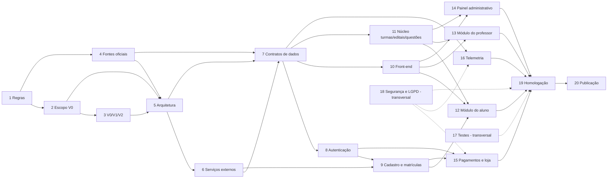

# 12 · Plano de transformação — do protótipo "Viver o Quad" ao produto real

**Data:** 30/07/2026 · **Atualizado em:** 01/08/2026 (seção "Atualização — Consolidação Arquitetural v1.0" e notas nas fases 4, 5, 6, 8, 9 e 15)
**Fonte:** auditoria do protótipo (src.html, build, docs/ e relatório rev. 2.3); Consolidação Arquitetural v1.0 (`docs/arquitetura/`)

> **Este documento descreve um PROTÓTIPO NAVEGÁVEL. Nada aqui é sistema de produção; comportamentos são simulados localmente no navegador, salvo indicação em contrário.**

> **AVISO OBRIGATÓRIO — LEIA ANTES DE QUALQUER COISA**
> Este plano é uma **proposta para leitura e decisão**. Nenhuma fase, entrega ou ação descrita aqui deve ser executada automaticamente. Cada fase só começa depois de aprovação explícita do gestor de produto (Danilo Moura) e, quando indicado, dos demais responsáveis. O plano **não estima prazos**: a equipe e a arquitetura do produto real ainda não são conhecidas, e qualquer cronograma agora seria invenção.

---

## Atualização — Consolidação Arquitetural v1.0 (01/08/2026)

Em 01/08/2026, o gestor Danilo Moura determinou, em documento oficial, a **Consolidação Arquitetural v1.0** (ver [`docs/arquitetura/00-arquitetura-oficial.md`](../arquitetura/00-arquitetura-oficial.md) e [`docs/arquitetura/01-modulos-planejados.md`](../arquitetura/01-modulos-planejados.md) — em caso de conflito com este plano, **a arquitetura oficial prevalece**). A mudança é **exclusivamente arquitetural**: nada foi implementado, nenhum módulo ganhou back-end ou autenticação real, e o comportamento funcional do protótipo não mudou (divisão do fonte com saída byte-idêntica; limpeza de código morto com regressão verde de 56 suítes).

**O que a Consolidação decidiu:**

- O Viver o Quad passa a ser **a plataforma principal do Quad Concursos**. Onze capacidades antes tratadas como sistemas externos viram **módulos internos**: cadastro; autenticação; matrículas; produção de materiais; banco de questões; simulados; inteligência pedagógica; loja; administração; relatórios; cronogramas.
- Permanecem **fora da plataforma** (integrações a definir): site e checkout (vitrine/venda), pagamentos/financeiro, plataforma de cursos (legado em avaliação), notificações push/e-mail (canal) e telemetria como serviço de dados (a decidir).
- A **decisão 21 foi revogada**: o cadastro deixa de nascer obrigatoriamente no site e passa a pertencer à arquitetura do app. O fluxo novo **não foi implementado** — o protótipo continua exibindo o portão "Cadastro no site do Quad" como demonstração, até especificação do módulo.
- Vocabulário de status obrigatório para os módulos: **"Demonstrado no protótipo (simulação local)"** e/ou **"Módulo Planejado"** (os dois coexistem num mesmo módulo). Módulo sem especificação suficiente é Módulo Planejado — sem exceção.
- As **regras econômicas seguem indefinidas** (loja, Quad Coins, Diamantes, gift cards permanecem previstos, mas nada foi estudado nem decidido). Os **riscos de segurança da auditoria permanecem válidos**, registrados como pendências; nenhuma solução foi implementada.

### O que a Consolidação adiantou das Fases 1–4 (e o que resta de cada uma)

| Fase | O que a Consolidação JÁ fez | O que RESTA |
|---|---|---|
| **1 — Regras de produto** | Uma decisão estrutural tomada e registrada por decisão explícita do gestor: **dec. 21 revogada** (cadastro pertence ao app). Hierarquia documental definida: `docs/arquitetura/` é o documento arquitetural oficial e único, prevalecendo sobre rev. 2.3 e auditoria em caso de conflito. | Rev. 2.4 do relatório-base; saneamento do registro de decisões (duplicatas 126–129); chancela vigente/revogada/pendente das RN-01–RN-61; toda a ata de decisões pendentes do doc 10 — **inclusive a economia, que segue indefinida**. |
| **2 — Escopo real da V0** | Vocabulário de status fixado ("Demonstrado no protótipo (simulação local)" / "Módulo Planejado"), que substitui a ambiguidade "demonstrado = pronto" e prepara a matriz liga/vitrine/desliga. | Praticamente tudo: matriz de funcionalidades, definição do piloto, lista de cortes. Nenhuma funcionalidade ganhou estado na V0 pela Consolidação. |
| **3 — Separação V0/V1/V2** | A entrega 3 (registro do que não entra sem nova decisão) foi parcialmente antecipada na prática: o **código morto vestigial foi removido do fonte** no commit de 01/08 (`openQuiz`, fluxo `CODE_OK`/autorização de dispositivo, chaves de tutorial nunca lidas, `fmtSync`, `tutDadosOk`) — com regressão completa. | Roadmap refaseado V0/V1/V2 e backlog rastreável completos. A remoção do código morto não decide fase de nada — só limpa o vestígio. |
| **4 — Fontes oficiais** | A pergunta-mãe da fase — "qual sistema é dono de cada domínio?" — foi respondida **no nível arquitetural** para 11 domínios: a plataforma é a dona lógica dos seus módulos internos. A matriz de propriedade dos docs 07/08 fica superada onde atribuía essas capacidades a sistemas externos. Fronteira externa também definida (site/checkout, pagamentos, cursos-legado, push/e-mail, telemetria-a-decidir). | Dono **por papel/área** de cada domínio (a Consolidação define o sistema, não a pessoa); plano de transição das fontes atuais (planilha da coordenação, cadastro de salas); regras de ouro ratificadas; e toda a especificação de cada módulo. |

Além disso, a Consolidação executou parte das **"Ações imediatas"** da seção 3 deste plano (fonte reorganizado e build corrigido) — ver as marcações naquela tabela.

### Próxima fase oficial: ESPECIFICAÇÃO MÓDULO A MÓDULO

A próxima fase determinada pela Consolidação é a **especificação módulo a módulo, antes de qualquer implementação**: cada um dos 11 módulos internos (fichas em `docs/arquitetura/01-modulos-planejados.md`) precisa de especificação suficiente para deixar de ser apenas "Módulo Planejado". Nenhuma fase de construção deste plano (10–16) começa antes disso. As fases 1–4 continuam valendo como estrutura de decisão — a Consolidação as adiantou em parte, não as substituiu.

### Ajustes de leitura nas fases deste plano

Onde este plano dizia "definir se X é sistema externo", **a definição já existe**: cadastro, autenticação, matrículas, produção de materiais, banco de questões, simulados, inteligência pedagógica, loja, administração, relatórios e cronogramas são **módulos internos da plataforma**. As fases 5, 6, 8, 9 e 15 recebem notas pontuais abaixo; o restante do texto original é mantido como registro da fotografia de 30/07.

---

## 1. Como ler este plano

- O protótipo (`src.html`, 11.920 linhas — CONFIRMADO NO CÓDIGO) é um **artefato de especificação viva**: demonstra telas, fluxos e 61 regras de negócio (RN-01–RN-61, documento 05 desta auditoria), mas **não contém uma linha de código de produção**. Todo dado vive em memória JS; a única persistência eram 8 chaves de `localStorage` com flags de tutorial/dispositivo (documento 06) — desde a limpeza de 01/08, restavam as 2 chaves vivas `vq_tut_skip` e `vq_intro_done` (as mortas foram removidas do fonte); *atualização 03/08 (dec. 196): são **3**, com a nova `vq_evolucao`, que faz a evolução do aluno sobreviver ao F5 **por dispositivo** — o que não muda a conclusão abaixo*. O plano parte desse fato: **o protótipo é referência de produto e UX, não base de código a evoluir**.
- As 20 fases abaixo são as mínimas para sair do protótipo e chegar a um produto publicável. Elas **não são estritamente sequenciais** — a seção 2 mostra as dependências —, mas as fases 1 a 4 (alinhamento de produto e fontes) são pré-requisito de praticamente todas as outras. Construir antes de decidir repetiria, em produção, as divergências que a auditoria encontrou no protótipo (documento 10).
- Cada fase traz: **objetivo · entregas · pré-requisitos · responsáveis sugeridos · riscos · decisões necessárias · critérios de conclusão**. Responsáveis são **papéis**, não nomes — a única pessoa nomeada é Danilo Moura, como decisor de produto, e os papéis citados no relatório rev. 2.3 (ex.: Gestor da Economia) aparecem como papéis.
- O vocabulário de classificação da auditoria é usado quando o plano cita o estado atual de algo: CONFIRMADO NO CÓDIGO · APENAS VISUAL · SIMULADO LOCALMENTE · DEPENDE DO FRONT-END REAL · DEPENDE DO BACK-END · DEPENDE DE BANCO DE DADOS · DEPENDE DE SISTEMA EXTERNO · HIPÓTESE · DECISÃO DE PRODUTO PENDENTE · DECISÃO TÉCNICA PENDENTE · DIVERGÊNCIA DOCUMENTAL.

### Papéis usados neste plano

| Papel | O que decide/faz aqui |
|---|---|
| **Danilo Moura (produto)** | Decisor final de produto; autor do relatório rev. 2.3; valida escopo, regras e cortes de fase |
| Gestor da Economia | Governança da economia (Quad Coin/Diamante) — papel previsto no relatório rev. 2.3 (§17/Anexo A) |
| Analista/redator de produto | Consolida documentos, registra decisões, mantém o corpo de regras |
| Arquiteto de software / líder técnico | Desenho da arquitetura, contratos, padrões, revisão técnica |
| Desenvolvedor(es) front-end | App do aluno/professor e telas administrativas |
| Desenvolvedor(es) back-end | Serviços, APIs, ledger, integrações |
| Engenheiro de dados / DBA | Modelagem, banco, pipeline de telemetria |
| Designer UX/UI | Design system, acessibilidade, adaptação do protótipo a telas reais |
| QA / engenheiro de testes | Suítes automatizadas, roteiros de aceitação, homologação |
| Especialista de segurança | Autenticação, RBAC, revisão de superfície de ataque, pentest |
| Encarregado de dados (DPO) / jurídico | LGPD, bases legais, retenção, termos de uso, crivo jurídico da economia |
| Financeiro | Crivo dos ralos de valor real (exigido pelo Anexo A da rev. 2.3), conciliação, estornos |
| Coordenação pedagógica | Cronograma, editais, questões, materiais — hoje origem em planilha (DEPENDE DE SISTEMA EXTERNO) |
| Operação (recepção/portaria/secretaria) | Liberações, pedidos, listas de presença |
| DevOps / infraestrutura | Ambientes, CI/CD, monitoramento, publicação |

---

## 2. Visão geral das fases e dependências

| # | Fase | Natureza | Depende diretamente de |
|---|---|---|---|
| 1 | Consolidação das regras de produto | Produto | — (usa a auditoria pronta) |
| 2 | Escopo real da V0 | Produto | 1 |
| 3 | Separação V0/V1/V2 | Produto | 1, 2 |
| 4 | Fontes oficiais | Produto + técnica | 1 |
| 5 | Arquitetura técnica | Técnica | 2, 3, 4 |
| 6 | Aplicações e serviços externos | Técnica + negócio | 4, 5 |
| 7 | Contratos de dados | Técnica | 4, 5, 6 |
| 8 | Autenticação | Técnica | 5, 7 |
| 9 | Cadastro e matrículas | Técnica + negócio | 6, 7, 8 |
| 10 | Estruturação do front-end | Técnica | 5, 7 |
| 11 | Núcleo de turmas/editais/questões | Técnica | 7, (4) |
| 12 | Módulo do aluno | Técnica | 8, 9, 10, 11 |
| 13 | Módulo do professor | Técnica | 8, 10, 11 |
| 14 | Painel administrativo | Técnica | 8, 10, 11 |
| 15 | Pagamentos e loja | Técnica + financeiro + jurídico | 7, 8, 9; decisões da fase 2 |
| 16 | Telemetria e eventos comportamentais | Técnica + produto | 5, 7, 18 (salvaguardas) |
| 17 | Testes | Técnica (transversal) | começa junto com 10–16 |
| 18 | Segurança e LGPD | Transversal | começa junto com 5; trava 15, 16, 19 |
| 19 | Homologação | Transversal | 12–18 |
| 20 | Publicação | Operacional | 19 |

Leitura rápida: **1→2→3 definem O QUE**; **4→7 definem ONDE MORA CADA DADO**; **5, 6, 8 definem COMO**; **10–16 CONSTROEM**; **17–18 PROTEGEM** (correm em paralelo desde o início da construção); **19–20 ENTREGAM**.

---

## Fase 1 — Consolidação das regras de produto

**Objetivo** — Transformar o conjunto hoje disperso e parcialmente contraditório (relatório rev. 2.3, registro de decisões 1–181, CHANGELOG com 116 entradas e o comportamento real do código) em **um único corpo de regras vigentes**, com as divergências conhecidas resolvidas por decisão explícita de Danilo — nunca por interpretação do desenvolvedor.

**Entregas**
1. **Rev. 2.4 do relatório-base**, absorvendo o que o protótipo consolidou e o que o gestor decidir manter/reverter — pendência formal registrada desde a decisão 11 (DIVERGÊNCIA DOCUMENTAL confirmada pela auditoria: "Score não é moeda" × Quad Coin ganho por atividade; economia "só V1" × Quad Store completa na V0; Diamante inexistente na rev. 2.3).
2. **Registro de decisões saneado**: resolver as duplicatas reais 126–129 (colisão de numeração confirmada), restaurar a ordenação, adotar IDs imutáveis para citação futura.
3. **Catálogo de regras vigentes ratificado** — a auditoria já entregou a base (documento 05, regras RN-01–RN-61, cada uma com evidência de código); falta a chancela "vigente/revogada/pendente" do produto.
4. **Ata de respostas às decisões de produto pendentes** listadas no documento 10, incluindo no mínimo: economia ligada/vitrine/desligada no piloto; status do Diamante; nome do mascote (QUAD × resíduos "Danilo"); roteiro oficial do tutorial (29 beats no código × 19 etapas na decisão 17 × 9 passos no README); reabertura do tutorial a cada login (decisão 105 × comportamento real do código); Pré-TAF (view `v-pretaf` existe e está órfã — CONFIRMADO NO CÓDIGO); exposição obrigatória do top-10 do ranking; lista oficial de palavrões do nome de guerra; regras de graduação do aluno; destino de Quests/Chat ao vivo.

**Pré-requisitos** — Leitura dos documentos 00–11 desta auditoria por Danilo e pelo analista de produto. Nada técnico.

**Responsáveis sugeridos** — Danilo Moura (decisor); analista/redator de produto (redação e registro); Gestor da Economia (capítulos econômicos da rev. 2.4).

**Riscos** — (a) Começar a construir sem fechar esta fase reproduz em produção as divergências do protótipo. (b) Citar decisões por número hoje é ambíguo (128/129 duplicadas). (c) A rev. 2.4 "adiada de novo" deixa o Anexo A (15 princípios da economia) sem valor normativo justamente quando a economia vira dinheiro real.

**Decisões necessárias** — Todas as DECISÃO DE PRODUTO PENDENTE do documento 10 (a entrega 4 é a lista mínima).

**Critérios de conclusão** — Rev. 2.4 publicada e declarada canônica; registro de decisões sem duplicatas e com ordenação restaurada; catálogo de regras com status atribuído a 100% das regras; zero decisões "bloqueantes de construção" em aberto.

---

## Fase 2 — Escopo real da V0

**Objetivo** — Definir com precisão **o que a V0 de produção contém**, separando o que o protótipo *demonstra* do que a V0 real deve *ligar*. A auditoria confirmou que o protótipo demonstra V0 + V1 + fatias de V2 (documento de divergências, seção 5): economia completa, Diamante (dinheiro real — V1-C no faseamento original), painel de Domínio completo, patente dinâmica com prova de promoção — tudo SIMULADO LOCALMENTE — enquanto o único pré-requisito duro da V0 segundo a rev. 2.3 (telemetria/linha de base) é hoje APENAS VISUAL.

**Entregas**
1. **Matriz "liga/vitrine/desliga" por funcionalidade** — para cada uma das funcionalidades inventariadas no documento 04, o estado na V0 real: ativa, visível-mas-inerte (vitrine), ou ausente.
2. **Definição do piloto** ("prova de vida" com alunos reais): coorte, canais, critério de sucesso — a métrica-mãe da rev. 2.3 é o retorno espontâneo (`OPEN_ORGANIC`), que nasce contaminado se a economia estiver ligada.
3. **Lista de cortes assumidos** (ex.: modo offline — no protótipo o alternador `#connToggle` nem existe no HTML, CONFIRMADO NO CÓDIGO; quiz ao vivo com polling simulado; leitura de QR por câmera).

**Pré-requisitos** — Fase 1 concluída (regras vigentes conhecidas).

**Responsáveis sugeridos** — Danilo Moura; analista de produto; Gestor da Economia (corte econômico); arquiteto (viabilidade dos cortes).

**Riscos** — (a) V0 grande demais: replicar tudo que o protótipo mostra multiplica o custo da primeira entrega. (b) V0 sem telemetria de verdade repete o erro do protótipo: a rev. 2.3 diz que "a V0 não começa sem" taxonomia de origem e linha de base. (c) Piloto com economia ligada invalida a métrica-mãe.

**Decisões necessárias** — Economia no piloto (ligada/vitrine/desligada — a decisão mais importante do plano inteiro); Pré-TAF dentro ou fora; quais telas EM BREVE permanecem visíveis; tamanho e perfil da coorte do piloto.

**Critérios de conclusão** — Matriz de funcionalidades assinada por Danilo; definição de piloto escrita; nenhuma funcionalidade sem estado atribuído.

---

## Fase 3 — Separação V0/V1/V2

**Objetivo** — Refasear o roadmap completo com base no que já foi demonstrado, devolvendo a cada versão o que lhe pertence e tornando o faseamento citável e estável.

**Entregas**
1. **Roadmap refaseado V0/V1/V2**, reconciliando o faseamento original da rev. 2.3 (V0 prova de vida → V1 geofencing, domínio completo, push, economia V1-A/B/C com ledger → V2 chat, guarnições, GvG/PvP) com as antecipações do protótipo.
2. **Backlog rastreável**: cada tela/regra/funcionalidade do protótipo apontando para a fase em que será construída de verdade (referenciando os IDs de regra do documento 05 e as fichas do documento 04).
3. Registro explícito do que o protótipo demonstra mas **não** entra em nenhuma versão sem nova decisão (ex.: mecânicas descartadas, código morto identificado — quiz engine genérico `openQuiz`, pop-up `#daniloPop`, fluxo de código por e-mail `CODE_OK` — CONFIRMADO NO CÓDIGO como vestigial).

**Pré-requisitos** — Fases 1 e 2.

**Responsáveis sugeridos** — Danilo Moura; analista de produto; arquiteto (dependências técnicas entre fases do roadmap).

**Riscos** — Roadmap tratado como promessa de datas (este plano não estima prazos e o roadmap também não deve, até haver equipe); "V1 antecipado" voltar a vazar para a V0 por pressão de demonstração.

**Decisões necessárias** — Ordem interna da economia (V1-A/B/C mantida?); em que versão entram IRA, push, geofencing, chat bidirecional, Quests.

**Critérios de conclusão** — Backlog com 100% dos itens do documento 04 mapeados a uma versão (ou explicitamente descartados); roadmap publicado junto à rev. 2.4.

---

## Fase 4 — Fontes oficiais

> **Atualização 01/08/2026 (Consolidação v1.0):** a fronteira interno×externo já está definida — os 11 módulos internos pertencem à plataforma; site/checkout, pagamentos/financeiro, plataforma de cursos (legado em avaliação), push/e-mail e telemetria (a decidir) ficam fora. Resta desta fase: dono por papel/área, plano de transição das fontes atuais e regras de ouro ratificadas. Ver a seção "Atualização" no topo.

**Objetivo** — Declarar, para cada domínio de dado, **qual sistema é a fonte oficial** (dono) e quem responde por ela — encerrando o padrão do protótipo em que o mesmo dado nasce em dois lugares (ex.: aluno com dois nomes completos, `DB_ALUNO.nome` ≠ `carreira.nomeCompleto`; professores da grade `CRONO` que não existem no banco `DOCENTES` — ambos CONFIRMADO NO CÓDIGO).

**Entregas**
1. **Matriz de fontes oficiais ratificada** — o documento 08 desta auditoria já propõe a matriz (cadastro geral, matrículas, financeiro, banco de questões, sistema pedagógico, eventos, materiais, notificações, relatórios/BI, autenticação, painel administrativo); falta ratificação e a nomeação de um **dono por domínio** (papel/área, não sistema).
2. **Plano de transição das fontes atuais**: cronograma da coordenação hoje vive numa planilha (DEPENDE DE SISTEMA EXTERNO, comentário no código); cadastro/matrícula viriam do site; capacidade de salas está hardcoded (`SALA_CAP` — DECISÃO TÉCNICA PENDENTE de onde vive esse cadastro).
3. **Regras de ouro publicadas**: nenhum dado de negócio nasce no app; o app exibe e coleta, o dono valida (o próprio código do protótipo declara isso: "a interface nunca decide sozinha quantos pontos foram conquistados").

**Pré-requisitos** — Fase 1 (regras); insumos: documentos 07 e 08 da auditoria.

**Responsáveis sugeridos** — Danilo Moura (arbitragem de donos); arquiteto; coordenação pedagógica; financeiro; operação.

**Riscos** — Domínio sem dono nomeado vira "dado de ninguém" e volta a ser duplicado; declarar dono sem dar a ele ferramenta (fases 11/14) cria fonte oficial no papel e planilha na prática.

**Decisões necessárias** — Dono por domínio; destino da planilha da coordenação (integra, importa ou substitui); onde vive o cadastro de infraestrutura física (salas/lotações).

**Critérios de conclusão** — Matriz assinada; todo domínio com dono e sistema-fonte declarados; divergências de fonte do protótipo mapeadas para a fonte oficial que as resolverá.

---

## Fase 5 — Arquitetura técnica

> **Atualização 01/08/2026 (Consolidação v1.0):** a decisão "o app é cliente da plataforma-base ou nasce ao lado dela?" está **respondida**: o Viver o Quad **é** a plataforma principal do Quad Concursos. A premissa de "app cliente de vários sistemas" cai. Esta fase segue pendente no que é técnico (stack, topologia, tempo real, hospedagem) e agora é precedida pela **especificação módulo a módulo**.

**Objetivo** — Desenhar a arquitetura-alvo do produto. O protótipo não impõe nenhuma (é um HTML único com IIFE de ~8.250 linhas de JS — CONFIRMADO NO CÓDIGO); o único contexto herdado é a plataforma-base citada na rev. 2.3 (Next.js + Spring Boot + Pagar.me) e o ecossistema previsto de sistemas.

**Entregas**
1. **Documento de arquitetura**: topologia (monólito modular × serviços), stack, banco(s), mensageria/tempo real, hospedagem, ambientes (desenvolvimento/homologação/produção), CI/CD.
2. **Decisão de plataforma do app**: nativo iOS/Android × híbrido × PWA — a rev. 2.3 fala em app iOS/Android; o protótipo é uma moldura fixa de 384 px que não responde a viewport real (CONFIRMADO NO CÓDIGO).
3. **Estratégia para os pontos que o protótipo só encena**: tempo real do quiz ao vivo (hoje polling randômico de 700 ms — SIMULADO LOCALMENTE); modo offline e fila de sincronização (hoje inatingível pela UI); armazenamento de mídia/materiais (hoje objectURL em memória).
4. **Padrões transversais**: versionamento de API, observabilidade, feature flags (necessárias para a matriz liga/vitrine/desliga da fase 2), build dev × prod (os hooks `window.__*` e credenciais demo não podem embarcar em produção — ver fases 17 e 18).

**Pré-requisitos** — Fases 2, 3 e 4 (escopo e fontes definem tamanho e fronteiras da arquitetura).

**Responsáveis sugeridos** — Arquiteto de software (liderança); desenvolvedores back-end e front-end sêniores; DevOps; especialista de segurança (revisão).

**Riscos** — (a) Superdimensionar (microserviços para um piloto de coorte pequena). (b) Subdimensionar o que a rev. 2.3 já exige na V1 (ledger auditável, push, geofencing). (c) Tentar "aproveitar" o código do protótipo: a auditoria confirma que ele é inadequado como base (sem módulos, sem testes, estado global acoplado entre as três personas, `innerHTML` dominante).

**Decisões necessárias** — DECISÃO TÉCNICA PENDENTE em bloco: stack definitiva; nativo × PWA; tempo real; hospedagem; relação com a plataforma-base existente (o app é cliente dela ou nasce ao lado dela?).

**Critérios de conclusão** — Documento de arquitetura aprovado por arquiteto + Danilo (ciente das implicações de produto); ambientes provisionados; esqueleto de CI/CD funcionando.

---

## Fase 6 — Aplicações e serviços externos

> **Atualização 01/08/2026 (Consolidação v1.0):** o catálogo desta fase **encolhe**: banco de questões, cadastro, matrículas, cronogramas etc. deixam de ser integrações e viram módulos internos (a construir, após especificação). Permanecem como integrações a definir: site e checkout, pagamentos/financeiro, plataforma de cursos (legado em avaliação), push/e-mail, telemetria como serviço de dados (a decidir) — além de serviços técnicos (storage/CDN, QR, extração de PDF, links externos, transmissão online).

**Objetivo** — Inventariar, negociar e formalizar a relação com todos os sistemas **fora do app** dos quais ele depende. O código do protótipo marca explicitamente 24 pontos `[INTEGRAÇÃO REAL]` (CONFIRMADO NO CÓDIGO, grep da auditoria) — cada um é uma integração a contratar ou construir.

**Entregas**
1. **Catálogo de integrações com criticidade**, partindo do documento 09 da auditoria. Mínimo confirmado no código/documentos: site principal e **checkout** (criação de conta + matrícula + recarga de Diamante; gateway Pagar.me citado na rev. 2.3); **plataforma de cursos**; **planilha da coordenação** (cronograma) ou seu substituto; **storage/CDN** de materiais; **geração e leitura reais de QR** (gift cards, portaria); **extração de questões de PDF** (quiz do professor, simulados digitais, árvore de edital); links externos de estudo (YouTube/QConcursos — DEPENDE DE SISTEMA EXTERNO); transmissão online (`meet.quadconcursos.com.br` aparece como link fictício); serviço de push/notificações (V1).
2. **Acordos por integração**: dono do sistema, responsável de cada lado, ambiente de testes, SLA mínimo.
3. **Plano B por integração crítica** (ex.: enquanto não houver parser de PDF, cadastro manual de questões — o protótipo já demonstra que o formulário existe apenas como toast, APENAS VISUAL).

**Pré-requisitos** — Fases 4 e 5.

**Responsáveis sugeridos** — Arquiteto (contratos técnicos); Danilo Moura (acordos de negócio); donos de cada sistema externo; DevOps.

**Riscos** — Integração crítica descoberta tarde (ex.: checkout sem API de "conta criada" bloqueia a fase 9 inteira); tratar o parser de PDF como trivial — é a integração mais citada no código e a mais incerta tecnicamente.

**Decisões necessárias** — Comprar × construir para: parser de PDF, QR, push, mensageria; e o formato do vínculo com a plataforma de cursos.

**Critérios de conclusão** — Catálogo completo com dono e criticidade; acordos assinados (ou plano B ativado) para toda integração da V0.

---

## Fase 7 — Contratos de dados

**Objetivo** — Especificar as **entidades e APIs** que substituem os ~40 arrays/objetos em memória do protótipo (inventário completo no documento 06). O protótipo é um excelente rascunho de modelo de dados — e um mau exemplo de chaves e fronteiras.

**Entregas**
1. **Dicionário de dados** por domínio, derivado do inventário: conta/perfil (`DB_ALUNO`, `carreira`, `CONTAS`), matrículas (`MATRICULAS`, `TURMAS_LOJA`, `ISOLADAS`), carteira/ledger (`score`, `diamantes`, `CREDITOS`, `GIFT_LOTES`), compras (`COMPRAS`, `ESTORNOS`, `PEDIDOS`), conteúdo (`CONCURSOS`, `EDITAL_*`, bancos de questões), pedagógico (`CRONO`, `BLOCOS_TURMA`, `QUIZZES`, `SIM_HIST`, Domínio), eventos (`EVENTOS`, `SIMULADOS`, `SIM_INSC`, `ACESSO_ST`), materiais (`MATERIAIS`), mensagens (`AVISOS`, `RECADOS`, `RECADOS_PROF`), docentes (`DOCENTES`).
2. **Especificação de APIs** (formato a definir na fase 5) com versionamento, paginação, idempotência nas operações de valor (compra, estorno, crédito, liberação de vaga).
3. **Correção das dívidas de modelagem confirmadas na auditoria**: professor identificado por **nome como chave primária** (o próprio código admite a limitação — DECISÃO TÉCNICA PENDENTE resolvida aqui com IDs estáveis); preços da Loja **raspados do DOM** no painel admin (CONFIRMADO NO CÓDIGO — inadmissível fora do protótipo); vagas por moeda mutadas no cliente (reserva de vaga precisa ser transação atômica no servidor); `turmaAtivaId`/`ALUNO_TURMA` redundantes; variável `score` que na verdade guarda Quad Coins (renomear no modelo real).
4. **Regras de persistência de estado do usuário** que hoje se perde no F5: turma ativa, escolha de avatar, perfil privado/público, progresso de missões, `vq_intro_done` (flag de conta guardada por dispositivo — CONFIRMADO NO CÓDIGO como inconsistência).

**Pré-requisitos** — Fases 4, 5 e 6.

**Responsáveis sugeridos** — Arquiteto; engenheiro de dados/DBA; desenvolvedores back-end; analista de produto (validação semântica dos campos).

**Riscos** — Copiar o modelo do protótipo sem crítica (herda as chaves frágeis); ou redesenhar tanto que as regras do documento 05 deixem de mapear — cada regra RN-01–RN-61 deve continuar rastreável ao novo modelo.

**Decisões necessárias** — Identificadores canônicos (aluno = conta do site? CPF? id próprio); granularidade do ledger; o que é evento imutável × estado mutável (compras e créditos pedem trilha imutável).

**Critérios de conclusão** — Dicionário e APIs revisados; toda estrutura do documento 06 com destino declarado (vira entidade, vira evento, ou morre); dívidas de modelagem listadas como resolvidas na especificação.

---

## Fase 8 — Autenticação

> **Atualização 01/08/2026 (Consolidação v1.0):** autenticação é **módulo interno** da plataforma. A entrega 4 abaixo muda de natureza: com a **dec. 21 revogada**, a conta não nasce mais obrigatoriamente no checkout do site — o cadastro pertence ao app, e a relação com o site/checkout vira integração a definir na especificação dos módulos Cadastro e Autenticação. Os riscos de segurança da auditoria permanecem válidos e registrados como pendências; nada foi implementado.

**Objetivo** — Substituir os três gates **APENAS VISUAIS** do protótipo por autenticação e autorização reais. Estado confirmado na auditoria: aluno entra com **qualquer e-mail + qualquer senha**; professor usa e-mail derivado do sobrenome + senha demo `quad1234` comparada em texto claro no cliente; admin aceita **qualquer e-mail com "@"** + chave literal `NPP-2026`; os três gates são overlays removíveis por DevTools; as credenciais demo estão impressas na própria tela e embarcadas no artefato público.

**Entregas**
1. **Serviço de identidade** com RBAC (papéis: aluno, professor, administrador N.P.P. — e a previsão de papéis futuros de operação/recepção).
2. **Sessões revogáveis server-side** — o protótipo já especifica o comportamento desejado (bloquear conta/professor derruba a sessão na hora — regras RN-05/RN-48, SIMULADO LOCALMENTE); em produção isso exige revogação real.
3. **Política de credenciais**: senha individual definida no cadastro (o código marca `[INTEGRAÇÃO REAL]` exatamente aí); recuperação de senha; chave de administrador emitida e revogada **por pessoa** pela direção (comentário do código); fim do e-mail derivado de sobrenome como identidade (colide em homônimos — DECISÃO TÉCNICA PENDENTE resolvida aqui).
4. **Integração com o cadastro do site** (a conta nasce no checkout — decisão 21): definição de sessão única/SSO entre site e app.

**Pré-requisitos** — Fases 5 e 7.

**Responsáveis sugeridos** — Especialista de segurança; desenvolvedor back-end; arquiteto; DPO (dados de identificação).

**Riscos** — Autenticação "depois a gente troca": qualquer piloto com dado real e gates visuais é incidente de segurança anunciado; RBAC raso demais para o painel admin (que concentra crédito de moedas, bloqueio de contas e estornos — funções que pedem permissões distintas e trilha de auditoria).

**Decisões necessárias** — Provedor de identidade (próprio × gerenciado); SSO com o site; MFA para administradores; política de expiração de sessão.

**Critérios de conclusão** — Login real funcionando nos três papéis em homologação; revogação de sessão testada; nenhuma credencial ou segredo no cliente; revisão de segurança da fase 18 sem achados críticos neste módulo.

---

## Fase 9 — Cadastro e matrículas

> **Atualização 01/08/2026 (Consolidação v1.0):** a **dec. 21 foi revogada** — cadastro e matrículas são módulos internos da plataforma; a conta não nasce mais no checkout do site como premissa. O texto abaixo (escrito sob a dec. 21) fica como registro histórico: a integração site/checkout→plataforma continua existindo, mas invertida (o site vende; o cadastro vive no app) e **a definir**. O fluxo novo **não foi implementado**: o protótipo mantém o portão "Cadastro no site do Quad" como demonstração, até especificação dos módulos Cadastro e Matrículas.

**Objetivo** — Implementar o ciclo real conta→matrícula→acesso que o protótipo apenas encena: a conta nasce no checkout do site junto com a matrícula (decisão 21; botão do protótipo dá toast "Redirecionando… (demo)" — APENAS VISUAL); a matrícula ativa libera o app; o vencimento trava tudo exceto a Loja (regra RN-03, SIMULADO LOCALMENTE).

**Entregas**
1. **Integração checkout→cadastro→matrícula** (DEPENDE DE SISTEMA EXTERNO): evento de matrícula criada/renovada/vencida chegando ao app em tempo hábil.
2. **Ciclo de vida da matrícula** no back-end: vigência, bloqueio por vencimento, regra de um turno por vez (RN-07), múltiplas matrículas e **turma ativa** persistida por usuário (RN-08 — hoje a preferência se perde no reload).
3. **Fluxo de estorno de matrícula** integrado ao financeiro (RN-10 — devolver vaga por moeda, desfazer posse, reatribuir turma ativa; no protótipo tudo local).
4. **Dados cadastrais**: nome, telefone e demais campos vêm do cadastro geral (o protótipo tem dois nomes para o mesmo aluno — a fonte oficial da fase 4 resolve); correção de dados "no site", como o tutorial já indica.

**Pré-requisitos** — Fases 6, 7 e 8.

**Responsáveis sugeridos** — Desenvolvedor back-end; dono do site/checkout; financeiro (estornos); analista de produto.

**Riscos** — Latência ou falha na sincronização site→app deixa aluno pagante trancado do lado de fora (pior experiência possível de estreia); regras comerciais (turno, choque de agenda) divergirem entre checkout e app se implementadas duas vezes.

**Decisões necessárias** — Onde vive a regra de elegibilidade de compra de turma (checkout, app ou serviço comum); prazo e política reais de estorno (os 7 dias e o "consumo mata estorno" — RN-26/RN-27 — são decisões de protótipo a ratificar com financeiro/jurídico).

**Critérios de conclusão** — Compra de matrícula em ambiente de teste cria conta e libera o app fim a fim; vencimento e estorno produzem os bloqueios/desbloqueios esperados; regra de turno validada nos dois lados.

---

## Fase 10 — Estruturação do front-end

**Objetivo** — Construir o front-end real **usando o protótipo como especificação visual e de fluxo**, não como código. Fundamentos da auditoria: 22 views, 21 overlays, 3 navbars, ~235 listeners num único IIFE sem módulos nem `use strict`; DOM por `innerHTML`; acessibilidade parcial (81 atributos ARIA e alt em todas as imagens, mas 0 `tabindex`, sem tecla Esc, sem focus-trap); moldura fixa de 384 px — tudo CONFIRMADO NO CÓDIGO.

**Entregas**
1. **Projeto front-end** na stack decidida na fase 5, com estrutura de módulos por domínio (a fronteira que o protótipo não tem).
2. **Design system extraído do protótipo**: tokens de cor/tipografia/espaçamento (o CSS de 1.568 linhas com temas claro/escuro é a fonte), componentes (cards, chips, overlays, barras), estados (AGORA/ENCERRADO/LOTADO/EM CHOQUE/INSCRITO etc.).
3. **Mapa protótipo→componente**: cada view e overlay do documento 02 apontando para a tela real correspondente (ou para o corte da fase 2).
4. **Acessibilidade como requisito**: navegação por teclado completa, focus-trap em modais, contraste revisado (a auditoria mediu combinações no limite do AA), `prefers-reduced-motion` mantido.
5. **Responsividade real** (o produto roda em telas de verdade, não numa moldura de demonstração).

**Pré-requisitos** — Fases 5 e 7 (stack e contratos).

**Responsáveis sugeridos** — Desenvolvedores front-end; designer UX/UI; QA (testes de componente desde o início — fase 17).

**Riscos** — "Portar" o IIFE em vez de reconstruir (herda acoplamento e falta de testes); perder fidelidade de UX na tradução — o protótipo carrega dezenas de microdecisões de experiência (confirmação em dois toques, contagens regressivas, estados de vitrine) que são regras de produto, não detalhes.

**Decisões necessárias** — Biblioteca de componentes própria × existente; estratégia de feature flags no cliente; suporte mínimo de navegadores/dispositivos.

**Critérios de conclusão** — Design system publicado; esqueleto navegável com autenticação real; mapa protótipo→componente cobrindo 100% das telas da V0 definida na fase 2.

---

## Fase 11 — Núcleo de turmas/editais/questões

**Objetivo** — Construir o núcleo de domínio que sustenta as três personas: concursos e árvores de edital, banco central de questões, turmas/modalidades/salas e cronograma. No protótipo: a árvore CFO é conteúdo real transcrito, as demais são exemplos compactos; os bancos de questões são demo com **gabarito no cliente**; a tela de banco de questões do admin é APENAS VISUAL; o cronograma é snapshot de uma planilha; a capacidade das salas é hardcoded.

**Entregas**
1. **Serviço de editais/concursos**: cadastro, versionamento e **reconciliação de edital** (o protótipo demonstra o conceito na tela `v-edital`, sem mecânica) — com o pipeline de extração de PDF da fase 6 ou cadastro estruturado manual como plano B.
2. **Banco central de questões**: entidades questão/alternativa/gabarito/classificação pela árvore do edital; gabarito **nunca** trafega para o cliente antes da correção (no protótipo a fraude é trivial — risco confirmado no documento 06).
3. **Turmas, modalidades e salas**: CRUD real com as validações que o protótipo já especifica (vagas ≤ lotação da sala, choque de sala, turno derivado do horário — regras RN-13–RN-17); cadastro de infraestrutura (salas/lotações) configurável.
4. **Cronograma como serviço**: grade por turma (chave = id, decisão 163), edição pela coordenação, histórico de alterações; substituição ou integração da planilha (decisão da fase 4).
5. **Corpo docente com ID estável** e vínculo professor×matéria×turma (regra RN-50), eliminando as duas fontes de professores do protótipo.

**Pré-requisitos** — Fase 7 (modelos); fase 6 (parser de PDF, se contratado); fase 4 (donos).

**Responsáveis sugeridos** — Desenvolvedores back-end; coordenação pedagógica (dona do conteúdo); engenheiro de dados; analista de produto.

**Riscos** — Subestimar a extração de PDF (edital e questões) — é o gargalo técnico mais citado no código; árvore de edital modelada rígida demais para os formatos reais de banca.

**Decisões necessárias** — Formato canônico da árvore de edital; workflow editorial de questões (quem cadastra, quem revisa, quem publica); política de reuso de questões entre concursos.

**Critérios de conclusão** — Um concurso real completo cadastrado fim a fim (edital → árvore → questões → turma → cronograma) sem tocar em código; validações de sala/vagas/choque cobertas por testes.

---

## Fase 12 — Módulo do aluno

**Objetivo** — Implementar a experiência do aluno sobre os serviços reais, preservando o que o protótipo validou de UX (documentos 02 e 03) e movendo toda decisão de valor para o servidor.

**Entregas**
1. **Onboarding/tutorial** conforme roteiro oficial ratificado na fase 1 (29 beats hoje no código), com estado por conta no servidor (não por dispositivo, como o `vq_tut_skip` atual).
2. **Missões/flashcards por turma** (blocos do dia, revisões D+1/D+7/D+30, atrasadas em 7 dias, bônus da noite — regras RN-11/RN-31/RN-44), com progresso persistido e recompensas creditadas pelo back-end (anti-farm: as recompensas únicas do protótipo são locais e reprocessáveis via F5).
3. **Quiz da aula** do lado do aluno (sem gabarito, sem premiação — RN-49) sobre o tempo real da fase 5.
4. **Domínio real**: percentuais calculados de desempenho efetivo (hoje hash determinístico — APENAS VISUAL), metodologia definida com o pedagógico (a rev. 2.3 exige "nunca hardcoded").
5. **Carreira/Quadrômetro**: score de carreira/patente/temporada, prova de promoção **corrigida no servidor** com as questões difíceis do aluno (RN-43), nota mínima por fase (a auditoria confirmou que `GAMI.fases[].notaMin` existe e não é usada — corrigir conforme decisão da fase 1); remoção definitiva do botão `[DEMO PROVISÓRIO]` de subir patente.
6. **Calendário, materiais (download via storage real), chat de recados, avisos por turma, rankings com privacidade de mão dupla** (RN-53–RN-56) e simulados digitais cronometrados com correção server-side.

**Pré-requisitos** — Fases 8, 9, 10 e 11.

**Responsáveis sugeridos** — Desenvolvedores front-end e back-end; designer; analista de produto; QA.

**Riscos** — Recriar no cliente as decisões de valor (score, moeda, promoção) por atalho de implementação — a regra transversal é: cliente exibe, servidor decide; perda de fidelidade nas mecânicas de engajamento que são o coração do produto.

**Decisões necessárias** — Metodologia do Domínio (fórmula, janela, pesos); política de recompensas (tabela oficial de score/QdC por atividade — hoje espalhada em constantes do protótipo); ranking (frequência de atualização, empates).

**Critérios de conclusão** — Roteiros de aceitação do aluno (derivados do documento 03) passando fim a fim em homologação com dados reais; nenhuma mutação de valor executada no cliente; paridade de UX validada por Danilo contra o protótipo.

---

## Fase 13 — Módulo do professor

**Objetivo** — Implementar o portal do professor: hoje o protótipo demonstra painel, agenda, calendário, relatório de horas e o quiz ao vivo com **polling randômico** e bancos demo (SIMULADO LOCALMENTE).

**Entregas**
1. **Painel do professor** com dados do cadastro docente oficial (foto e senha próprias; demais campos editáveis só pela coordenação — como o protótipo especifica).
2. **Agenda/aulas do dia** derivadas do cronograma real; relatório de aulas/horas/eventos derivado de dados reais (a versão do protótipo extrapola da grade; a UI já marca "presença confirmada por chamada" como integração real — definir a fonte de presença).
3. **Quiz ao vivo real**: criação a partir de PDF (parser da fase 6) ou do banco de questões; ativação por turma; respostas reais dos alunos em tempo real; relatório por questão sem números inventados (princípio que o protótipo já adota: relatório em branco até haver resposta).
4. **Comunicação**: recados da administração com recibo de leitura; resposta do professor à recepção (hoje EM BREVE — entra conforme roadmap da fase 3).

**Pré-requisitos** — Fases 8, 10 e 11 (e o tempo real da fase 5).

**Responsáveis sugeridos** — Desenvolvedores front-end e back-end; coordenação pedagógica (validação do fluxo docente); QA.

**Riscos** — Tempo real subestimado (um quiz com sala cheia é o primeiro teste de carga real do produto); professor com dado de aluno além do necessário (minimização — fase 18).

**Decisões necessárias** — Fonte oficial de presença em aula (chamada manual? integração?); alcance do relatório do professor (quais dados de aluno ele vê).

**Critérios de conclusão** — Quiz ao vivo com alunos reais em sala de homologação funcionando (criação→ativação→respostas→relatório); roteiros de aceitação do professor passando; carga testada no cenário de sala cheia.

---

## Fase 14 — Painel administrativo

**Objetivo** — Construir o painel N.P.P. real sobre os serviços das fases anteriores. O protótipo demonstra um painel extenso e funcional em memória (21 blocos — documento 02): banco de professores, turmas/isoladas, salas, crédito manual, contas, mensagens por público, gift cards, estornos, avisos, cronograma, materiais, eventos, simulados, skins/itens, liberações (pedidos, portaria, inscritos) e relatórios.

**Entregas**
1. **Governança de pessoas**: banco de professores com ID estável (rename sem propagação frágil — no protótipo renomear propaga string por 6 estruturas); bloqueio/desligamento com revogação de sessão real; gestão de contas de aluno.
2. **Operação diária**: avisos, cronograma, materiais (upload para storage real), eventos (reserva de sala/Estúdio com conflito), simulados, catálogo da loja e preços **sobre dados, não sobre DOM** (dívida confirmada da auditoria).
3. **Liberações**: portaria de eventos e simulados (check-in que consome a compra — RN-27/RN-35), pedidos de retirada, listas de conferência geradas de verdade (hoje `window.print()` — DECISÃO TÉCNICA PENDENTE sobre PDF servidor).
4. **Trilha de auditoria em toda ação de valor**: crédito manual, bloqueio, estorno, alteração de preço, liberação de entrada — quem, quando, por quê (o protótipo já registra motivo no crédito; generalizar).
5. **Relatórios com dados reais** (individuais, por turma, gerais, loja), substituindo os sintéticos por hash; blocos EM BREVE conforme roadmap.
6. **Correção das divergências herdadas**: texto da UI que promete "item volta ao estoque na entrega" sem o código fazer (DIVERGÊNCIA DOCUMENTAL na própria UI); `ATIVIDADES` fixas duplicando eventos vivos.

**Pré-requisitos** — Fases 8, 10 e 11.

**Responsáveis sugeridos** — Desenvolvedores front-end e back-end; operação (usuária final das Liberações); financeiro (crédito/estorno); QA.

**Riscos** — O painel é o maior módulo em superfície (8 views no protótipo) — sem priorização interna, atrasa tudo; permissões largas demais (fase 8) transformam qualquer conta admin em risco sistêmico.

**Decisões necessárias** — Papéis internos do painel (recepção × coordenação × direção); quais relatórios entram na V0; política de crédito manual (limites, alçadas).

**Critérios de conclusão** — Operação consegue rodar um dia real da escola só pelo painel (cenário de aceitação com a equipe de operação); toda ação de valor com trilha de auditoria consultável.

---

## Fase 15 — Pagamentos e loja

> **Atualização 01/08/2026 (Consolidação v1.0):** a **loja é módulo interno** da plataforma; **pagamentos/financeiro permanecem fora** (integração a definir). Loja, Quad Coins, Diamantes e gift cards seguem previstos, mas as **regras econômicas seguem indefinidas** — não foram estudadas; nada aqui deve ser lido como decisão econômica tomada. Esta fase continua condicionada à rev. 2.4 e ao crivo Financeiro+Jurídico.

**Objetivo** — Transformar a economia demonstrada (SIMULADO LOCALMENTE de ponta a ponta) em economia real com dinheiro real — o degrau mais sensível do plano, condicionado pelas decisões da fase 2 e pelo crivo previsto no próprio Anexo A da rev. 2.3 (Financeiro + Jurídico para ralos de valor real).

**Entregas**
1. **Ledger server-side de Quad Coins e Diamantes**: saldo nunca no cliente; lançamentos imutáveis; conciliação. (No protótipo, o saldo é uma `var` e o artefato publica hooks que creditam moeda — aceitável na demo, impossível em produção.)
2. **Integração de pagamento** (gateway citado na rev. 2.3: Pagar.me — DEPENDE DE SISTEMA EXTERNO): recarga de Diamante no site, conciliação, estorno financeiro real.
3. **Loja/Quad Store real**: catálogo, estoque físico, vagas por moeda com **reserva atômica**, confirmação de compra, posse/inventário (mochila, skins com cadeia e farda única — RN-24/RN-25), estornos em janela com consumo (RN-26–RN-28).
4. **Gift cards reais**: geração de lote com QR verdadeiro, resgate único validado no servidor.
5. **Governança da economia**: parametrização central (preços, recompensas, limites) em painel — não em constantes de código como no protótipo (`GAMI`, `TUT_REW`, `TR_REW` etc.); papel do Gestor da Economia formalizado.

**Pré-requisitos** — Fases 7, 8, 9; decisões da fase 2 (se a V0 vai de vitrine, esta fase pode ser parcialmente adiada — mas o ledger é pré-requisito de QUALQUER economia ligada).

**Responsáveis sugeridos** — Desenvolvedor back-end sênior; financeiro; DPO/jurídico (crivo dos ralos de valor real); Gestor da Economia; Danilo Moura (aprovação final).

**Riscos** — O maior do plano: dinheiro real sobre mecânica de jogo. Fraude (gabarito/recompensa manipulados), estorno como vetor de abuso (o protótipo já antecipa o problema com "consumo mata estorno"), obrigações fiscais/jurídicas da moeda interna, e a divergência documental de fundo (o modelo econômico do Anexo A — Marcos de Conquista, Score Qualificado — não é o que o protótipo demonstra; sem a rev. 2.4 esta fase não tem norma).

**Decisões necessárias** — Modelo econômico definitivo (Anexo A × modelo do protótipo); enquadramento jurídico do Diamante e do gift card; políticas de estorno com o financeiro; alçadas de crédito manual.

**Critérios de conclusão** — Transação completa fim a fim em homologação (recarga→compra→consumo→estorno) com conciliação batendo; auditoria de segurança da fase 18 sem achados críticos; crivo Financeiro+Jurídico documentado.

---

## Fase 16 — Telemetria e eventos comportamentais

**Objetivo** — Construir o que a rev. 2.3 declara pré-requisito da V0 e que hoje é uma linha de texto estática (APENAS VISUAL, confirmado: `origem: OPEN_ORGANIC · eventos: 14 · linha de base: ativa`): telemetria real de eventos, taxonomia de origem de sessão e linha de base comportamental — a infraestrutura da métrica-mãe (retorno espontâneo) e do futuro IRA.

**Entregas**
1. **Plano de tracking**: catálogo de eventos (nome, propriedades, quando dispara), taxonomia de origem (ORGANIC/CLASS/PUSH/MENTOR/NOTICE/CAMPAIGN — só citada em texto no protótipo), identificador pseudonimizado (o mock atual cola o e-mail na string de telemetria — antipadrão a não repetir).
2. **Pipeline de coleta e armazenamento** (engenharia de dados) com retenção definida na fase 18.
3. **Dashboard da métrica-mãe** e da linha de base (tempo por questão, padrões de resposta, abandono, constância — escopo citado em docs/01).
4. **Salvaguardas implementadas, não só declaradas**: "comportamento é computado, nunca gravado como rótulo" e "Dado → Cuidado → Valor → Oferta" são hoje diretrizes sem implementação (DECISÃO TÉCNICA PENDENTE de como computar sem rotular: agregação, retenção curta do bruto, pseudonimização).
5. **IRA (Índice de Risco de Abandono)** apenas quando o roadmap da fase 3 o chamar — com governança de uso definida antes do primeiro cálculo (quem vê, o que dispara, proibição de uso comercial direto).

**Pré-requisitos** — Fases 5 e 7; salvaguardas da fase 18 desenhadas ANTES da coleta.

**Responsáveis sugeridos** — Engenheiro de dados; desenvolvedor back-end; analista de produto (catálogo de eventos); DPO (revisão de cada evento coletado); Danilo Moura (métrica-mãe).

**Riscos** — Coletar demais "porque um dia serve" (viola minimização LGPD); coletar de menos e descobrir no fim do piloto que o retorno espontâneo não é mensurável; deixar a telemetria para depois do lançamento — repetiria o único descumprimento formal de pré-requisito da V0 que a auditoria confirmou.

**Decisões necessárias** — Ferramenta de analytics (própria × terceiro — DEPENDE DE SISTEMA EXTERNO se terceiro); catálogo mínimo da V0; janela de retenção do evento bruto; governança do IRA.

**Critérios de conclusão** — Eventos do catálogo chegando ao pipeline em homologação; dashboard da métrica-mãe operante; parecer do DPO sobre o catálogo; taxonomia de origem funcionando no app real.

---

## Fase 17 — Testes (transversal)

**Objetivo** — Estabelecer a malha de testes versionada que o protótipo nunca teve no repositório: a auditoria confirmou **zero arquivos de teste versionados** — as suítes Playwright citadas em todo o CHANGELOG viviam fora do repo, e os 31 hooks `window.__*` no código são sua única memória.

**Entregas**
1. **Testes versionados junto do código** desde o primeiro módulo (unitários, integração, E2E) — regra de esteira: nada entra sem teste.
2. **Suíte E2E derivada dos roteiros do protótipo**: os fluxos do documento 03 (login→tutorial, compra→estorno, quiz professor↔aluno, portaria, criação de turma) viram cenários automatizados do produto real.
3. **Política de instrumentação de teste**: hooks de teste jamais embarcam no build de produção (no protótipo os hooks e até `window.lojaCompraLog` vão ao artefato público — DECISÃO TÉCNICA PENDENTE resolvida aqui com builds separados dev/prod).
4. **Testes de carga** nos pontos quentes conhecidos: quiz ao vivo (sala cheia), reserva de vaga por moeda (concorrência), portaria em dia de evento.
5. **CI com portões**: build, testes, análise estática, verificação de segredos.

**Pré-requisitos** — Fase 5 (CI/CD); corre em paralelo às fases 10–16.

**Responsáveis sugeridos** — QA/engenheiro de testes (dono); todos os desenvolvedores; DevOps.

**Riscos** — Repetir o padrão do protótipo (testes fora do repositório = manutenção sem rede de proteção); E2E frágil que vira ruído e é desligado.

**Decisões necessárias** — Ferramentas (o histórico com Playwright é um ponto a favor de mantê-lo); cobertura mínima exigida por módulo; critérios de bloqueio de merge.

**Critérios de conclusão** — Esteira bloqueando regressões; cenários E2E dos fluxos críticos verdes em homologação; build de produção comprovadamente sem hooks/instrumentação.

---

## Fase 18 — Segurança e LGPD (transversal)

**Objetivo** — Levar o produto a um estado defensável de segurança e conformidade. A auditoria confirmou no protótipo: credenciais demo hardcoded e impressas na tela e gates apenas visuais (doc 00, §5.3; doc 01, §8); 31 hooks de manipulação embarcados no artefato público (doc 01, §6.4; doc 04, TR-05); dados pessoais simulados plausíveis — nomes e telefones em formato real de Salvador (doc 00, §5.3; doc 04, TR-14); e uma análise prospectiva LGPD com pontos sérios para o produto real — perfilamento educacional, IRA, ranking nominal, possível presença de menores (doc 00, §5.3; doc 07, §6; doc 09, observações transversais).

**Entregas**
1. **Inventário de dados pessoais e bases legais** (RoPA): partir do inventário da auditoria; classificar por sensibilidade; minimizar no cliente.
2. **Políticas**: retenção e eliminação (hoje nenhum documento trata do tema — DECISÃO DE PRODUTO PENDENTE confirmada); direitos do titular (acesso, correção, eliminação de conta); consentimentos onde necessário (ex.: exposição no top-10 do ranking, hoje sem opt-out).
3. **Revisão de decisão automatizada** (LGPD art. 20): prova de promoção automática e futuro IRA — transparência e canal de revisão humana.
4. **Higiene de segurança**: nenhum segredo no cliente; criptografia em trânsito e repouso; gestão de segredos; hardening dos ambientes; **pentest** antes da publicação; resposta a incidentes.
5. **Regras para dados de demonstração**: dados fictícios obviamente fictícios (telefones em faixa reservada — recomendação da auditoria), e o protótipo público jamais recebe dado real.
6. **Termos de uso e política de privacidade** do app, alinhados à regra comercial "nunca Dado → Oferta".

**Pré-requisitos** — Começa junto com a fase 5; trava as fases 15 (economia), 16 (telemetria) e 19 (homologação) até seus pareceres.

**Responsáveis sugeridos** — DPO/jurídico; especialista de segurança; arquiteto; Danilo Moura (aceite de risco residual).

**Riscos** — Tratar LGPD como papelada de fim de projeto: telemetria (16) e economia (15) sem desenho de privacidade nascem irregulares; vazamento de perfil educacional de aluno é dano reputacional direto ao Quad.

**Decisões necessárias** — Nomeação do encarregado (DPO); bases legais por tratamento; política de menores de idade; retenção por categoria de dado; escopo do pentest.

**Critérios de conclusão** — RoPA publicado; pareceres emitidos para 15 e 16; pentest executado com achados críticos corrigidos; termos e política publicados.

---

## Fase 19 — Homologação

**Objetivo** — Validar o produto construído contra as regras da fase 1 e a experiência do protótipo, com as pessoas certas, antes de qualquer aluno real.

**Entregas**
1. **Roteiros de aceitação por persona** (aluno, professor, admin/operação), derivados dos documentos 03 (fluxos) e 05 (regras) — cada regra vigente RN-01–RN-61 com um caso de aceitação correspondente ou uma justificativa de corte.
2. **Rodadas de homologação com usuários internos** (equipe do Quad como alunos-teste; professores reais; operação usando as Liberações).
3. **Comparação lado a lado protótipo × produto** para as telas da V0 (paridade de UX aprovada por Danilo — o protótipo é o padrão-ouro de experiência).
4. **Gestão de defeitos**: triagem, correção, re-teste; critérios de severidade.
5. **Ensaio geral do piloto**: um ciclo completo (matrícula→onboarding→semana de uso→evento→relatórios) em ambiente de homologação com dados realistas.

**Pré-requisitos** — Fases 12–16 entregues no escopo da V0; pareceres da 18; suítes da 17 verdes.

**Responsáveis sugeridos** — QA (condução); Danilo Moura (aceite de produto); operação e coordenação pedagógica (aceite operacional); analista de produto (rastreabilidade regra→caso).

**Riscos** — Homologar contra memória em vez de contra documento (por isso a rastreabilidade com o documento 05); pressão para encurtar a homologação e "ajustar em produção" — com economia e dado pessoal envolvidos, não há "ajustar em produção" aceitável.

**Decisões necessárias** — Critérios go/no-go do piloto; severidades que bloqueiam o go.

**Critérios de conclusão** — 100% dos casos de aceitação executados; zero defeitos bloqueantes abertos; aceite formal escrito de Danilo, operação e pedagógico; go do piloto emitido.

---

## Fase 20 — Publicação

**Objetivo** — Colocar o produto no ar de forma controlada e rodar o piloto que dá nome à V0 ("prova de vida"), com medição honesta da métrica-mãe.

**Entregas**
1. **Publicação nos canais decididos na fase 5** (lojas iOS/Android e/ou web), com processo de release documentado, versionamento e plano de rollback.
2. **Monitoramento e alerta em produção** (disponibilidade, erros, latência, funil de login); plantão/suporte definido para o período do piloto.
3. **Piloto com coorte pequena** conforme a fase 2: onboarding assistido, canal de feedback, acompanhamento diário da telemetria (fase 16).
4. **Relatório do piloto**: retorno espontâneo e linha de base comportamental medidos; recomendação fundamentada de próxima etapa (avançar ao roadmap da fase 3, ajustar, ou reprovar hipóteses).
5. **Destino do protótipo**: arquivado como referência histórica com documentação atualizada (ver "Ações imediatas" abaixo) — e **nunca** confundido com o produto (URLs, nomes e artefatos claramente distintos).

**Pré-requisitos** — Fase 19 com go emitido.

**Responsáveis sugeridos** — DevOps (release); Danilo Moura (comunicação e decisão pós-piloto); analista de produto (relatório); suporte/operação.

**Riscos** — Piloto sem plano de rollback; expectativa pública desalinhada (o piloto é experimento, não lançamento comercial); métrica-mãe lida com viés (coorte pequena exige leitura estatística honesta).

**Decisões necessárias** — Data e coorte finais do piloto; política de comunicação; critérios quantitativos de sucesso do retorno espontâneo; decisão pós-piloto (quem decide e com que dados).

**Critérios de conclusão** — Produto em produção estável durante o piloto; relatório do piloto entregue e discutido; decisão de continuidade registrada no registro de decisões (saneado na fase 1).

---

## 3. Ações imediatas de baixo risco (fora das fases — cada uma ainda exige aprovação)

Itens apontados pela auditoria que não dependem do plano e podem ser aprovados isoladamente. **Nenhum deve ser executado sem ok explícito**. *Atualização 01/08/2026: os itens marcados ✅ foram executados nos commits da Consolidação (divisão do fonte em `src/` e limpeza de código morto, ambos de 01/08, com saída byte-idêntica e regressão de 56 suítes).*

| Ação | Evidência da auditoria | Aprovador |
|---|---|---|
| ✅ **FEITO (01/08)** — README/docs 00/01/03 reescritos contra a Consolidação (URL vigente do artefato registrada no repo, build.py documentado, tamanhos reais, árvore com `src/`, roteiro de demo atual); resta só a validação formal da URL pelo gestor | Commit "documentação alinhada à nova arquitetura"; a DIVERGÊNCIA DOCUMENTAL em cadeia do documento 11 fica sanada | — (executado; Danilo valida a URL) |
| ✅ **FEITO (01/08)** — build corrigido: `build.py` agora usa caminho relativo ao script (portátil), valida as 20 partes de `src/` e valida tokens ausentes **e** sobras; `build.ps1` espelha as mesmas validações | Commit "fonte dividido em src/ (20 partes) e build portátil" | — (executado) |
| ✅ **FEITO (01/08)** — removidos do versionamento `Viver o Quad.rar` (9 MB, órfão) e `quad-coin.png` (904 KB, nenhum build usa) | Commit "fonte dividido em src/ (20 partes) e build portátil" | — (executado) |
| ✅ **FEITO (01/08)** — código morto removido do fonte com regressão completa: `hojeISO` duplicada, fluxo revogado de autorização de dispositivo (`CODE_OK` etc.), chaves `vq_*` mortas, `openQuiz`/`fmtSync`/`tutDadosOk`; 8 comentários enganosos atualizados. `LINKS_ONLINE` preservado como ponto de integração planejado; o bug do reset (não limpa `vq_intro_done`) segue aberto por decisão | Commit "remoção de código morto verificado" | — (executado) |
| Versionar as suítes Playwright do protótipo (hoje só os hooks `window.__*` provam que existiram) | CONFIRMADO (zero testes no repo) | Desenvolvedor |
| Remover do protótipo o botão `[DEMO PROVISÓRIO]` de patente e corrigir textos residuais ("Danilo, o guia", "Missões 10+10") — se o protótipo seguir sendo mostrado | CONFIRMADO NO CÓDIGO (l.7740; l.3633/3637) | Danilo |
| Sanear o registro de decisões (duplicatas 126–129, ordenação) — antecipa parte da fase 1 | CONFIRMADO (documento de divergências, seção 2) | Danilo + analista de produto |

---

## 4. Riscos transversais do plano inteiro

1. **Construir sem decidir** — o maior risco não é técnico: é começar as fases 5+ com as fases 1–2 abertas. Toda divergência documental encontrada pela auditoria nasceu de decisão não registrada ou não propagada.
2. **Confundir protótipo com produto** — o protótipo seguirá existindo e convence; a tentação de "só ligar um backend nele" ignora que ele não tem módulos, testes, segurança nem persistência (CONFIRMADO NO CÓDIGO em todos os relatórios).
3. **Economia antes da governança** — dinheiro real (Diamante/Pagar.me) sem ledger, crivo jurídico-financeiro e rev. 2.4 é o cenário de dano máximo.
4. **Telemetria de novo adiada** — é o único pré-requisito formal da V0 descumprido no protótipo; sem ela o piloto não mede a métrica-mãe e a V0 perde o propósito.
5. **Equipe e arquitetura desconhecidas** — por isso este plano não tem prazos. A primeira consequência prática das fases 1–5 deve ser dimensionar a equipe; qualquer compromisso de data antes disso é DECISÃO DE PRODUTO PENDENTE sem base.

---

*Fim do documento 12. Este plano complementa e depende dos documentos 00–11 da auditoria; em caso de conflito entre este plano e uma decisão futura registrada, vale a decisão registrada.*
